# CaaS Projektarbeit - Ausbaustufe 3

Simon Wimmesberger (S2010307046)

<div style="page-break-after: always;"></div>

## Softwarearchitektur
Die Softwarearchitektur von CaaS basiert auf Angular 14 und des Bootstrap 5 CSS-Framework.
Grundsätzliches handelt es sich um eine single-project-architecture, daher alle Komponenten befinden sich im selben
Projekt. Dabei wurden die Komponenten logisch gruppiert und in Angular Module zusammengefasst.
Zur unterstützung von Mehrsprachigkeit wurde angular/localize verwendet. Zur Kommunikation mit dem Backend wird
der Angular HTTP Client verwendet.
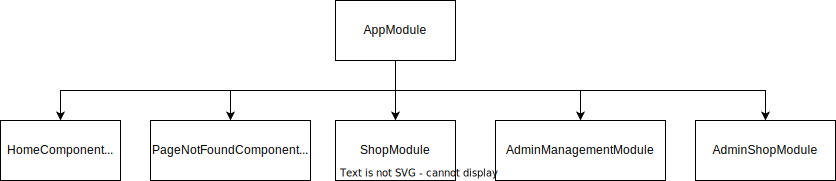

Für das Design der Komponenten wird durchgängig Sass im SCSS-Syntax verwendet. Sass ist ein CSS-Präprozessor 
mit Variablen, Schleifen und vielen anderen Funktionen, die CSS nicht beinhaltet, 
die Erstellung von CSS vereinfacht und die Pflege großer Stylesheets erleichtert.

## Projektstruktur
UI-Komponenten werden im 'components' Ordner des jeweiligen Moduls abgelegt.
Layout Komponenten die ein Basis UI zur Verfügung stellen und nur ein Teil ausgetauscht wird (router-outlet)
werden im 'layouts' Ordner abgelegt.
Services und DTO-Klassen werden in den jeweiligen Modulen im 'shared' Ordner abgelegt.

## I18n
Alle sprachspezifische Texte wurde mit dem i18n Attribut versehen oder der $localize Funktion übergeben.
Dabei wird jedem Text eine spezifische ID zugewiesen. Diese Texte werden dann mit dem Befehl 'ng extract-i18n --output-path src/locale'
extrahiert. Bei den unterstützten Sprachen handelt es sich um Englisch und Deutsch. Die Ausgangssprache ist Englisch.
Die deutschen Übersetzungen werden in der datei 'src/locale/messages.de-xlf' verwaltet.
Zum Ausführen der deutschen Variante wurde eine angular Konfiguration mit dem Namen 'de' hinzugefügt.
Diese Konfiguration kann mit 'ng run startDe' gestartet oder mit 'ng run buildDe' gebuildet werden.
Damit sich entsprechend auch das Währungssymbol ändert zwischen den Sprachen, musste noch ein Currency Provider
hinzugefügt werden.
```typescript
providers: [
  { provide: DEFAULT_CURRENCY_CODE, useFactory: getLocaleCurrencyCode, deps: [LOCALE_ID] }
]
```
Die Seite sieht dann in den jeweiligen Sprachen so aus:
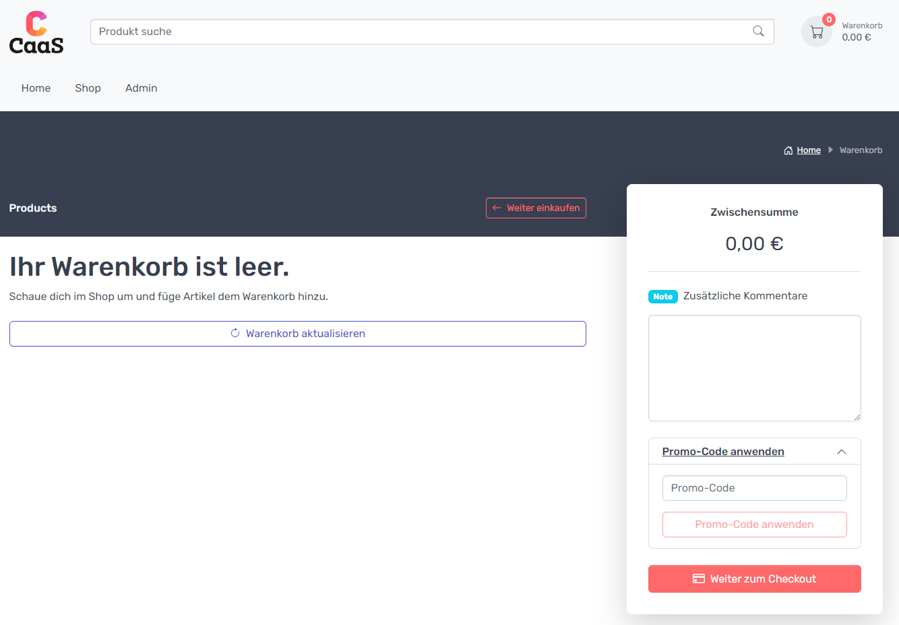
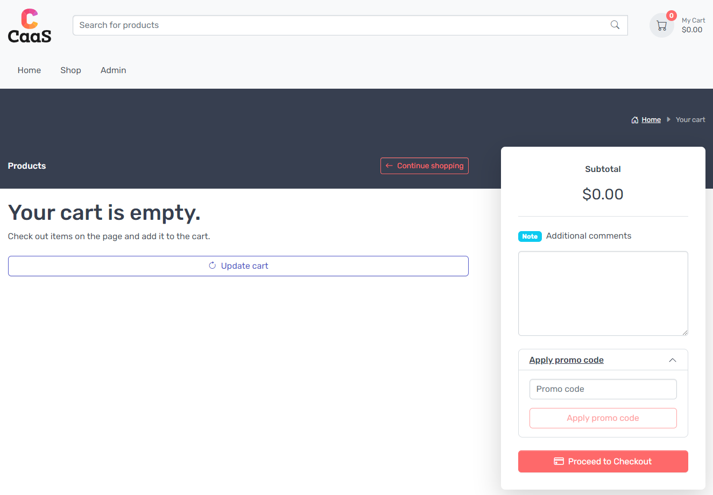

## Lazy-Loading
Da es nicht sinnvoll ist, die Administrationskomponenten zu laden wenn man sich auf dem Shop befindet,
bzw. die Shopkomponenten wenn man sich auf der Administration befindet. Daher wird das Shop-Modul
bzw. die Administrationsmodule nachgeladen wenn diese benötigt werden, also aufgerufen werden.

## Unit Testing
Für alle Komponenten und Services wurden Unit Tests erstellt, die zumindest verifizieren ob der Service
oder die Komponente erstellt werden kann.
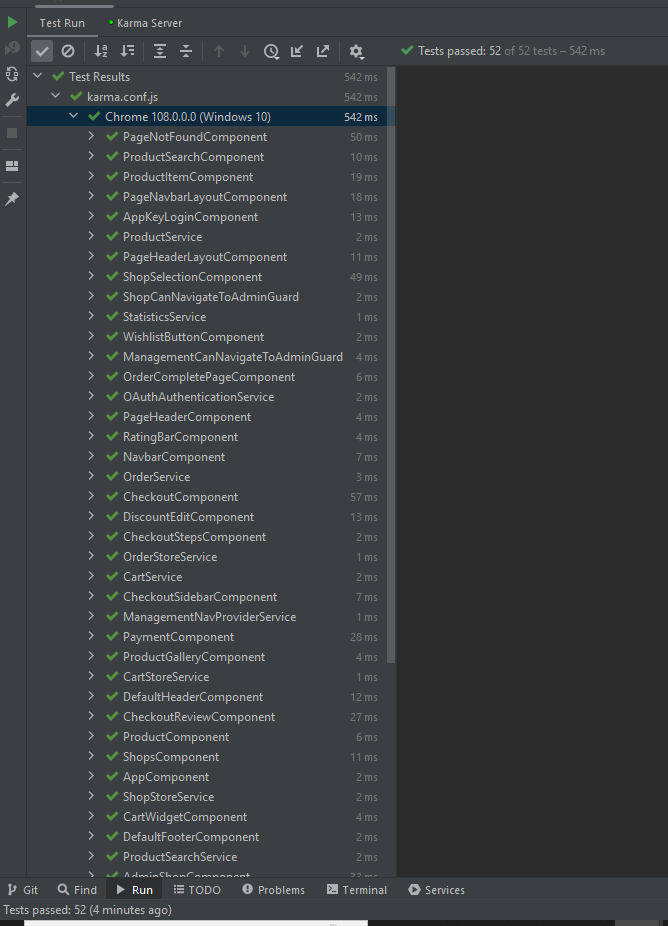

## Aufbau
Auf der Startseite werden alle Shops (Tenants) angezeigt, mit einem Klick auf einen dieser Shops wird zu
dem entsprechenden Shop gewechselt. In der Praxis würde jeder Tenant seine eigene Seite hosten und nicht wie
hier in der selben Instanz laufen. Der einfachheit halber habe ich mich jedoch entschieden die Applikation
so zu konfigurieren, um in der selben Instanz alle Shops aufzurufen. Zusätzlich befindet sich ein Link
zur generellen Administrationsseite um die Shops zu administrieren.

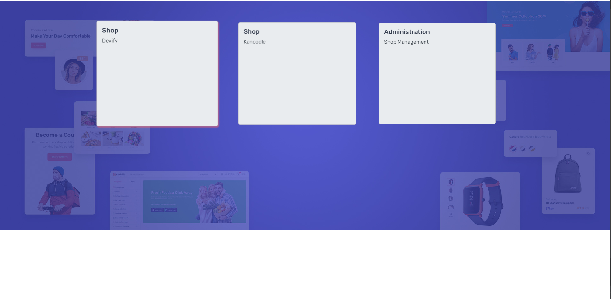

### Shop
Beim Klick auf einen spezifischen Shop, gelangt man zu den Produkten und der Produktsuche des selektierten 
Shops.

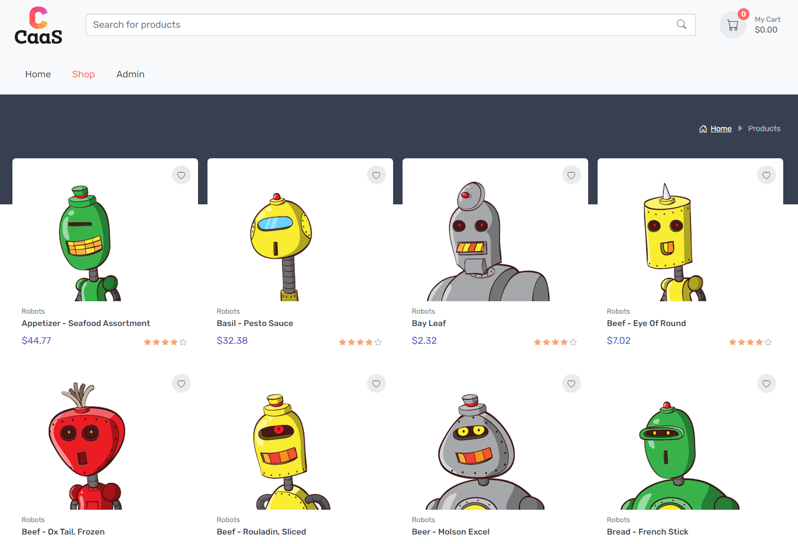

Hierbei werden nicht alle Produkte auf einmal vom Server geladen, sondern immer nur eine Seite.
Am Ende jeder Seite befindet sich die Möglichkeit auf die nächste oder vorherige Seite zu wechseln.
Dies wird auch entsprechend in der URL mit Query Parametern widergespiegelt.
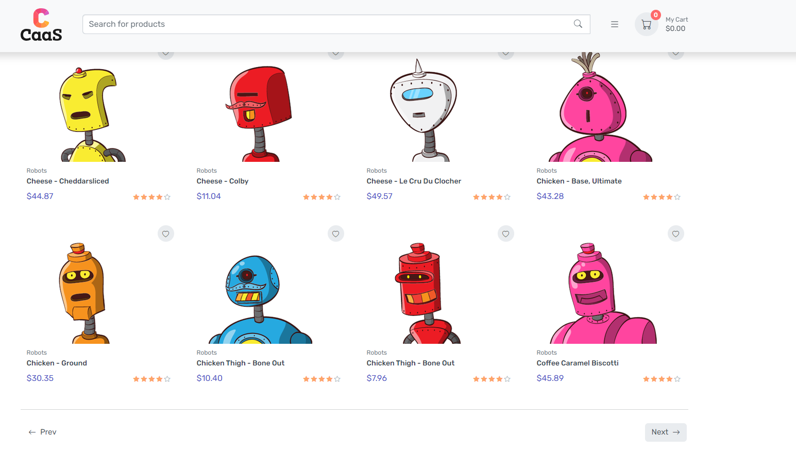

Außerdem scrollt die Produktsuche mit, wenn entsprechend runtergescrollt wird.
Wenn die Produktsuche verwendet wird, wird auch entsprechend die URL angepasst und die Produkte werden gefiltert.
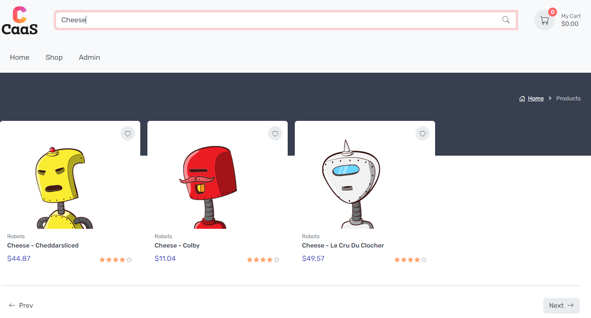
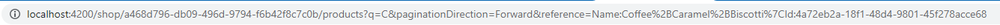

Die Suche ist über einen zentrale Produkt Suche Service implementiert. Die Produktübersicht
registriert sich auf ein Observable das bei der Änderung des Textes im Suchfeld entsprechend
ein Event auslöst. Diese Änderung führt dann jeweils zu einem request. Mit diversen rxjs
Operatoren wird das ganze entsprechend optimiert (debounce, switchMap, ...). 

Wenn mit der Maus über ein Produkt gehovered wird, wird ein entsprechender Button angezeigt
um das Produkt dem Warenkorb hinzuzufügen.
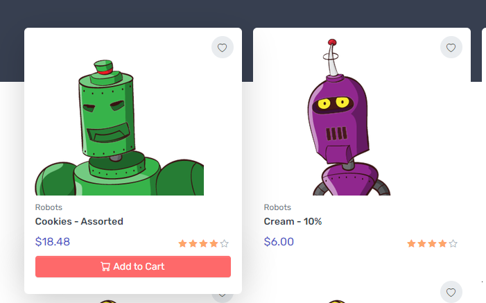
Die Sterne Bewertung die angezeigt wird, ist eine eigene Angular Komponente die entwickelt wurde.
Dabei ist für jede Komponente eine 4-Sterne Bewertung eingestellt, da das Backend Bewertungen
nicht unterstützt. Das Herz wäre dafür da um das Produkt einer Wunschliste hinzuzufügen, dies ist
Backend seitig jedoch auch nicht unterstützt.

Für den Warenkorb, wurde wieder ein zentraler Service entwickelt, der die Produkte im Warenkorb verwaltet.
Hierfür wird im LocalStorage wenn noch kein Warenkorb existiert eine ID für einen Warenkorb erzeugt
und entsprechend im Backend angelegt. Sollte im LocalStorage bereits eine ID hinterlegt sein,
werden die Produkte entsprechend von dieser ID geladen und dieser ID hinzugefügt.
Damit alle Komponenten von Änderungen des Warenkorbs informiert werden, wird auch hier wieder ein
Observable zur Verfügung gestellt, das immer den aktuellen Stand des Warenkorb emittiert.
Dieses Observable wird z.B. vom Cart Widget verwendet, um den aktuellen Warenkorb Inhalt anzuzeigen.

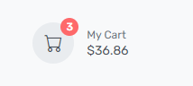

Bei einem Klick auf ein Produkt, öffnet sich die Produktdetailseite. Hier wird zusätzlich noch
die Beschreibung eines Produkts angezeigt. Außerdem wird ein Gallerie Widget angezeigt, wo zwischen
mehreren Ansichten eines Produkts gewechselt werden kann.
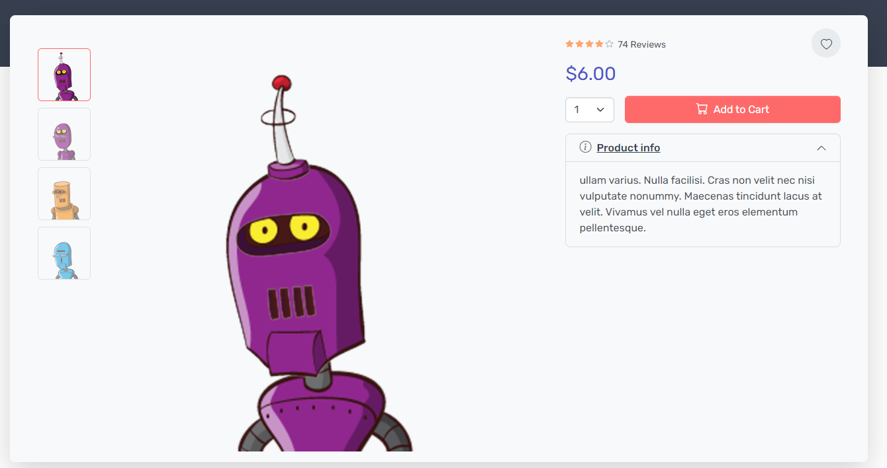

Über jeder Seite wird ein "Breakcrumb" angezeigt, dieses wird dynamisch über das Routing generiert.
Zur Anzeige wird der 'title' der im Router für einen Pfad hinterlegt ist, angezeigt.

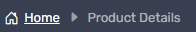

Nachdem alle gewünschten Produkte, dem Warenkorb hinzugefügt wurden, geht es in den Checkout Prozess.
Dieser beginnt im Warenkorb, wo alle im Warenkorb befindlichen Produkte sowie eine Kostenübersicht
angezeigt wird.
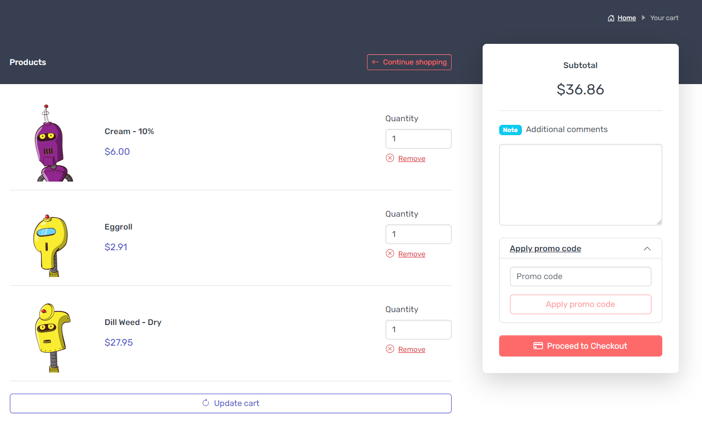

Bei der Anzeige der Produkte werden Angular Reactive Forms verwendet, da Produkte gelöscht und
die Anzahl der Produkte verändert werden kann. Bei einem Klick auf "Update Cart" wird das Formular
entsprechend ausgelöst und der Warenkorb am Backend aktualisiert.
Auf der rechten Seite kann ein einzelne Promo-Code aktiviert werden, bzw. falls bereits einer
aktiviert wurde, dieser wieder gelöscht werden.

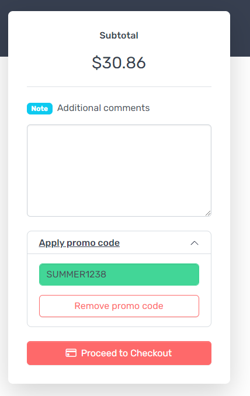

Das Kommentarfeld ist momentan nicht implementiert, da die Backend Funktionalität fehlt.

Bei einem Klick auf den "Proceed to Checkout" button wird der nächste Schritt im Checkout
Prozess angezeigt. 
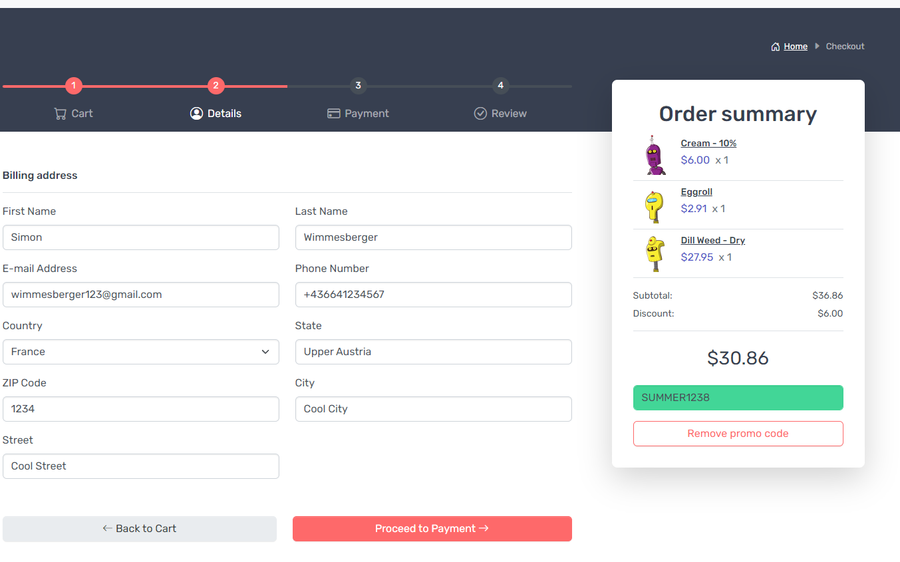

Hier wird wieder ein Angular Reactive Forms angezeigt um die Kundendetails auszufüllen.
Über den Details wird eine "Stepper" Komponente angezeigt, die extra für den Checkout Prozess
entwickelt wurde, die den aktuellen Fortschritt anzeigt. Die einzelnen "Steps" können auch geklickt
werden um zu dem jeweiligen Schritt zu gelangen.

Auf der rechten Seite wird eine leicht veränderte Sidebar angezeigt, die immer noch eine Übersicht
aller Produkte im Warenkorb anzeigt. Auch hierbei handelt es sich um eine separate Angular Komponente.

Die nächste Seite zeigt das Kreditkarten Formular.
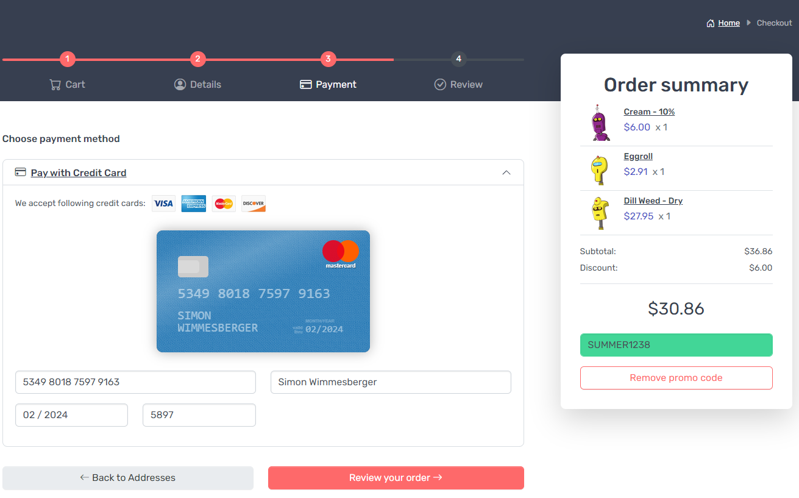
Hierbei wird eine dynamische Javascript Komponente zur Visualisierung der Kreditkarte angezeigt. 
Diese reagiert live auf die eingaben der Nutzer.

Die letzte Seite des Checkouts ist die Review Seite.
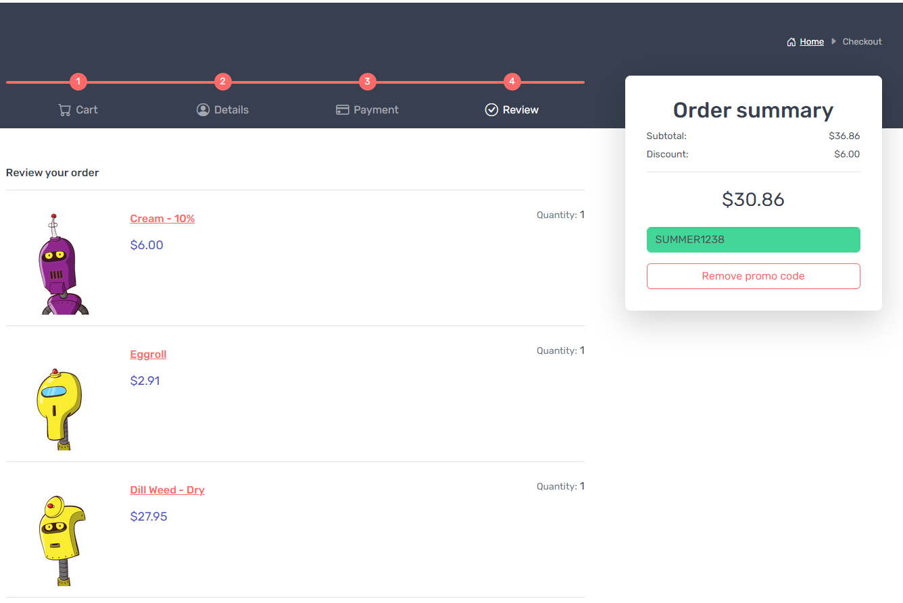
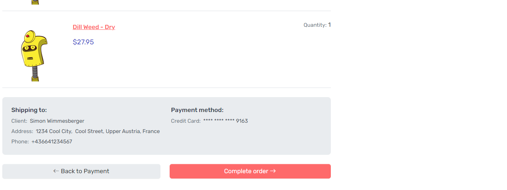

Hier werden nochmal alle weiteren Details des Warenkorbs sowie die Kundendetails angezeigt.
Die Sidebar ist auf dieser Seite wieder leicht modifiziert. Die Produkte werden wieder in der 
Hauptansicht angezeigt und die Sidebar zeigt nur noch den finalen Betrag und wie sich dieser zusammensetzt.

Beim Klick auf "Complete Order" wird die Bestellung final ans Backend abgeschickt.
Besonders hier wurde auf eine ordentliche Fehlerbehandlung geachtet, die dem Nutzer als
Fehlermeldungen präsentiert werden.

Sollte die Bestellung durchgehen und die Karte auch entsprechend belastet werden können, wird eine
finale Seite angezeigt, die dem Nutzer über die erfolgreiche Bestellung informiert. Der Downloadlink
zum Produkt wird via. E-Mail versendet.
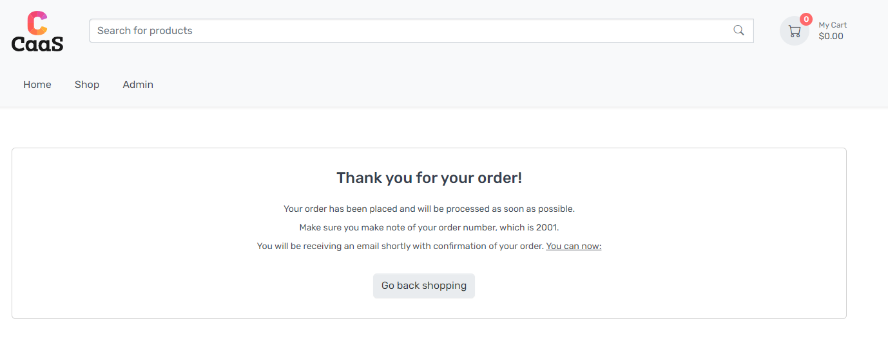

### Shop Management
Der Hauptadministrator kann über den Link auf der Hauptseite zum Management
Modul wechseln. Diese Seite wurde mit einem "Guard" geschützt und erfordert
eine OAuth Authentifizierung. Als OAuth Server wird hierfür "idsvr4.azurewebsites.net"
genutzt, dabei handelt es sich um einen von Manfred Steyer gehosteten IdentityServer.

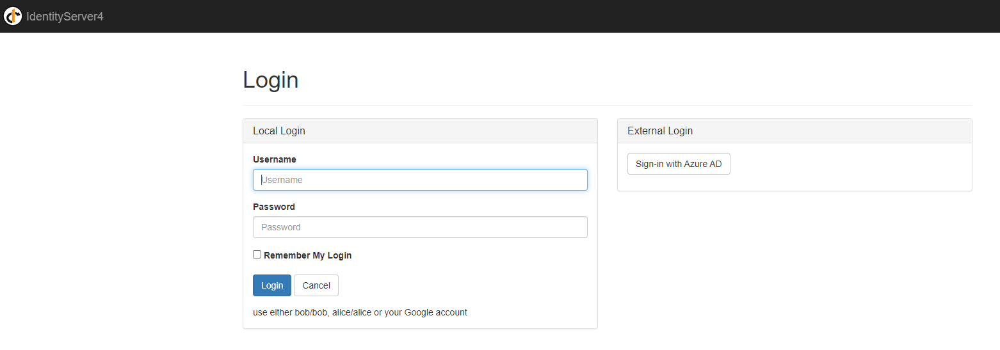

Auf der Hauptseite der Administration kommt man direkt zur Übersicht über alle Shops.
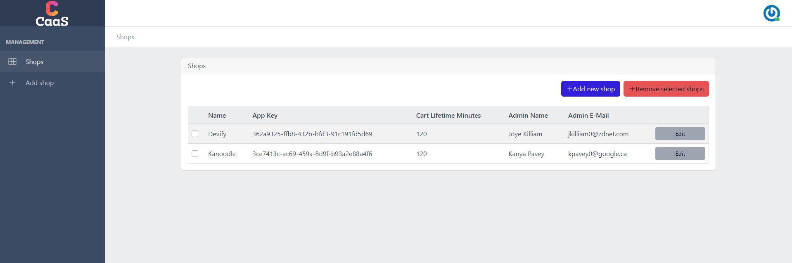

Das Administrationsmodul basiert auch auf Bootstrap 5. Verwendet jedoch CoreUi Komponenten.
CoreUi stellt zahlreiche fertige Angular Komponenten für Enterprise Anwendungen zur Verfügung.
Für das styling dieser Komponenten setzt CoreUi wiederrum auf Bootstrap 5. Wodurch
sich ein responsive und homogenes UI ergibt.

Im Header wird der aktuell eingeloggte Benutzer angezeigt. Dabei wird von Gravatar
das Profilbild angezeigt welches für die E-mail hinterlegt ist angezeigt.

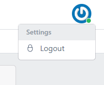

Beim klick auf das Profilbild öffnet sich ein dropdown wo sich die Option zum Ausloggen befindet.

Die Tabelle für die Shops selbst wird mit Angular auf Basis der Daten gerendert.
Die erste Spalte ist dabei immer eine Checkbox um Zeilen für das löschen zu selektieren.
Die letzte Spalte beinhaltet immer einen Button um eine einzelne Zeile zu editieren.
Bei den zwei Buttons über der Tabelle können entweder die selektierten Zeilen gelöscht werden
oder beim Klick auf "Add new Shop" wird die Seite zum hinzufügen eines neuen Shops geöffnet.

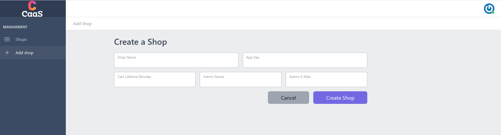

Bei der Shop hinzufügen Seite wird wieder ein Angular Reactive Form angezeigt.
Dieses Form wird auch entsprechend auf die Eingaben validiert.
Beim Klick auf "Create Shop" wird der Shop entsprechend im Backend angelegt.
Ein Klick auf "Cancel" führt wieder zur Shop Übersicht.

Zur Administration eines Shops kommt man wenn man auf "Admin" klickt und sich auf einer
Shop spezifischen Seite befindet.
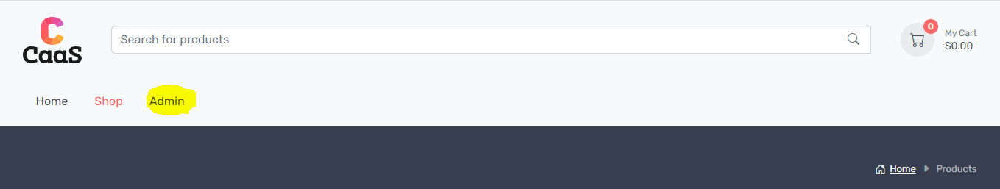

Dort ist wieder ein Guard eingerichtet der überprüft ob man in diesen Shop eingeloggt
ist. Wenn nicht, wird man auf die Login Seite weitergeleitet.
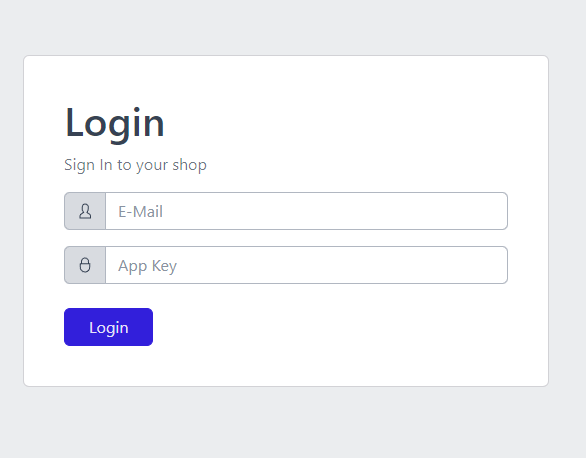

Hier muss die E-Mail Adresse des Shop Admins und auch der AppKey dazugehörige AppKey
eingegeben werden und dem Shop administrieren zu dürfen.
Die eingegebenen Daten werden im Backend verifiziert und im Fehlerfall wird entsprechend
eine Fehlermeldung angezeigt.

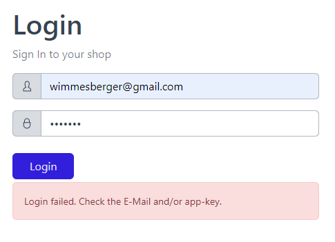

Nach dem Login landet man auf der Administrationsseite. Die Startseite bilder das dashboard.
Hier wurden mithilfe von chartjs, einer sehr weit verbreiteten Charting library, diverse
Datenvisualisierungen eingebunden. Die Seite ist an sich wieder komplett gleich aufgebaut
wie die Shop Management Admin Seiten. Allerdings stehen in der Sidebar andere Optionen zur
Verfügung. Hier wurde viel Wert auf reuseability gelegt.

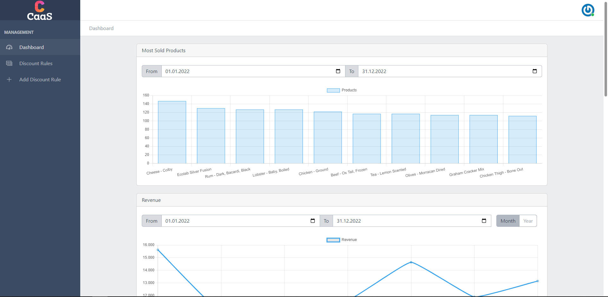

Das erste Chart (BarChart) zeigt die Top-10 meist verkauften Produkte im gewählten Zeitraum.
Das Chart wird automatisch aktualisiert, wenn sich der Zeitraum ändert.

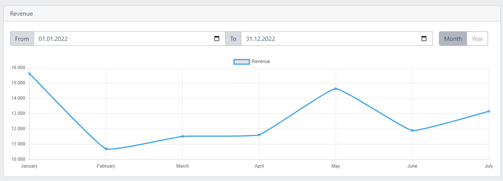
Das zweite Chart (LineChart) zeigt den Umsatz im jeweiligen Monat/Jahr (je nach Auswahl) für den 
gewählten Zeitraum.

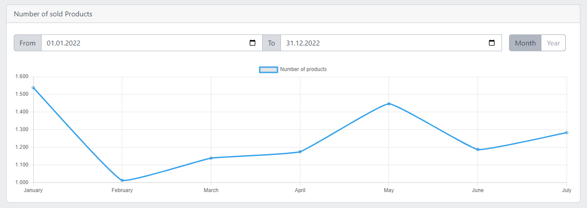
Das dritte Chart (LineChart) zeigt die Anzahl der verkauften Produkte im jeweiligen Monat/Jahr
(je nach Auswahl) für den gewählten Zeitraum.

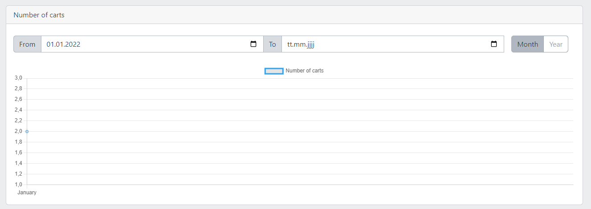
Das vierte Chart (LineChart) zeigt die Anzahl aktiver Carts im jeweiligen Monat/Jahr.
Da das Backend laut Angabe alle inaktiven Carts nach einer Zeit löscht. Sind hier
keine historischen Daten verfügbar. In der Angabe stand explizit ("aus der Datenbank löschen"),
in der Praxis könnte man hier auch ein soft-delete für Carts verwenden oder auch die
Warenkorb Statistik separat mitführen. Wenn kein "To" Datum ausgewählt wird, werden die
Daten bis zum aktuellen Zeitpunkt angezeigt.

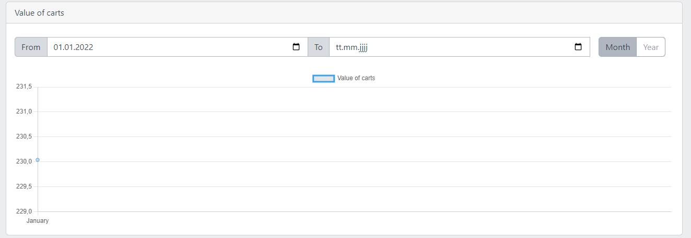
Beim fünften Chart (LineChart), gilt das selbe Problem. Hier wird jedoch der Wert
der Carts angezeigt.

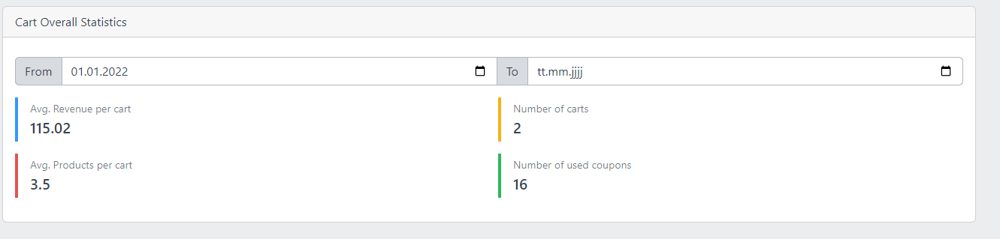
Das letzte Chart zeigt allgemeine Informationen wie der durchschnittliche Wert
eines Carts im gewählten Zeitraum oder die Anzahl der verwendeten Coupons für
Bestellungen.

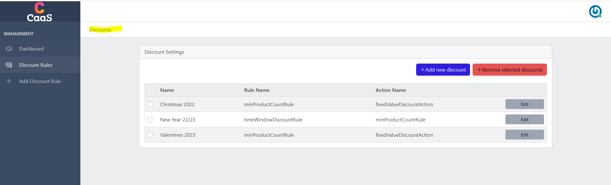

Kommen wir zum "Discount" Management. Hier können die aktiven "Discounts" des Shops
verwaltet werden. Der Aufbau ist hier wieder sehr ähnlich zum Shop Management.
Die Tabelle zeigt die vorhandenen Einträge, Einträge können editiert, angelegt und
über die Checkboxen mit dem Löschen Button auch wieder gelöscht werden.
Details der Parameter werden in der allgemeinen Ansicht nicht dargestellt. Diese
werden erst auf beim Editieren sichtbar.

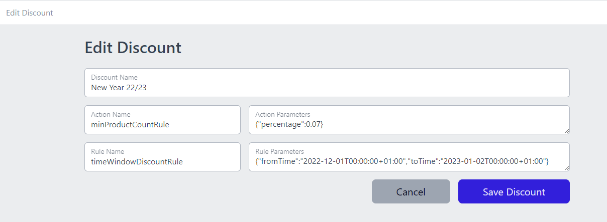

Beim Editieren der Discounts, werden auch die Parameter angezeigt.
Diese werden in Form von JSON Textfeldern angezeigt, um die Implementierung zu erleichtern
und da es nicht gefordert war dynamisch ein Form auf Basis der Parameter zu generieren.
Hier gibt es also durchaus auch noch Potenzial zur Verbesserung, indem man die Parameter
in ein dynamisches Form packt und auch die Art der Regeln und Aktionen nicht über den
Namen wissen muss, sondern entsprechend auch Checkboxen der verfügbaren Aktionen und Regeln
anzeigt.

Der Benutzer hat hier folgende Möglichkeiten zur Definition von Aktionen:
* 'fixedValueDiscountAction'
  * 'value'
* 'percentageDiscountAction'
  * 'percentage'

Die möglichen Regeln, sind folgende:
* 'minProductCountRule'
  * 'productId' 
  * 'numberOfItems' 
* 'timeWindowDiscountRule'
  * 'fromTime' (ISO-Date)
  * 'toTime' (ISO-Date)

Diese Aktionen und Regeln werden dem Nutzer als Information mit Beispielen zur
Verfügung gestellt und müssen dementsprechend eingetragen werden.

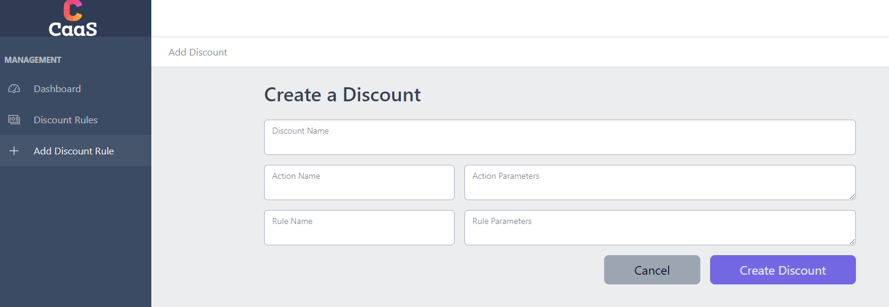

Die Seite zum Hinzufügen, sieht wieder analog zum Editieren sehr ähnlich aus.

## Installation
Die Backend API URL konfigurieren:
src/environments/environment.prod.ts
```
export const environment = {
  production: true,
  url: "http://localhost:5140"
};
```

Die Produktion Version builden:
```
npm run build
```

Im dist/ Order befinden sich jetzt zwei Versionen. Eine englische und eine deutsche Variante.
Diese Versionen können dann auf jeden x-beliebigen HTTP Server wie (Nginx) deployed werden.
Da es sich um eine monolithische Variante handelt, muss nur eine Version für die verschiedenen Sprachen
deployed werden.
