# CaaS Projektarbeit - Ausbaustufe 1 & 2

Roman Kofler-Hofer (S2010307022)

Simon Wimmesberger (S2010307046)

<div style="page-break-after: always;"></div>

## Softwarearchitektur
Die Softwarearchitektur von CaaS basiert auf Domain-driven Design mit einer klassichen
Zwiebelarchitektur.

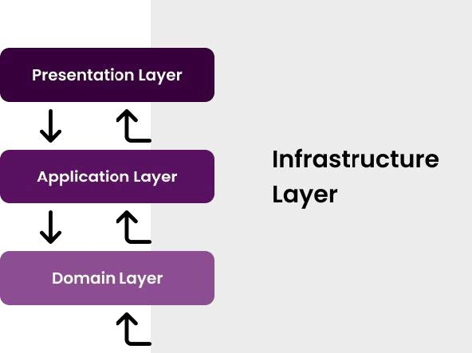
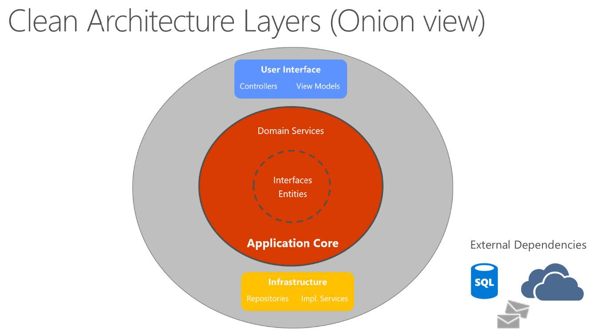

Das CaaS.Api Projekt bildet hierbei die Präsentationsschicht, hier befindet sich die REST-API
mit OpenAPI Spezifikation.
Das CaaS.Core Projekt bildet den Service und Domain Layer. 
Daher befinden sich dort unsere Domain Objekte (Cart, Order, Customer, ...), die Repository Interfaces
und die Service Interfaces sowie deren Implementierung.
Die Services haben nur eine Abhängigkeit auf die Repository Interfaces.

Die Implementierungen der Repository Interfaces befinden sich im CaaS.Infrastructure
Projekt, welches sich auf der Infrastrukturschicht befindet. 
Diese Schicht bildet damit die Implementierung der Datenzugriffsschicht.
Als Persistierung wird PostgreSQL 15 verwendet, da es sich hier um eine freie und sehr mächtige Datenbank handelt.

### Datenzugriffsschicht

Bei der Datenzugriffsschicht werden verschiedene Entwurfsmuster eingesetzt:
* AdoTemplate
* UOW (UnitOfWork)
* Data Access Object (DAO)
* Repository

Bei einem Repository handelt es sich in unserem Fall um eine Klasse die mit Domainobjekten arbeitet.
Bei den DAOs handelt es sich um Klassen die für einzelne Datenbank Tabellen Einträge liefern können.
Diese DAOs werden ausschließlich von Repositories verwendet, um Domainobjekte zu erstellen.
Da die Verwendung eines ORM wie Entity Framework nicht erlaubt ist, konnte so durch den Einsatz
von DAOs das mappen von mehreren Tabellen auf ein Domainobjekt vereinfacht werden.

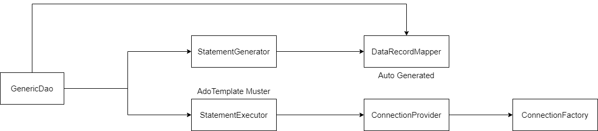

Da es sich beim Mappen von einzelnen Zeilen einzelner Tabellen um eine sehr repitetive Aufgabe handelt,
haben wie hierfür eine generische Implementierung erstellt. Für jede Tabelle muss ein
Datenhaltungsobjekt erstellt werden, welches die Spalten einer Tabelle beschreibt.
Hierbei setzen wir das Konvention vor Konfiguration Paradigma ein. 
Daher muss das Property in der Datenmodellklasse in PascalCase zur jeweiligen snake_case Spalte in der Datenbank passend angelegt werden.
Als Beispiel, folgende SQL Definition einer Tabelle:
```sql
CREATE TABLE "shop_admin" (
    "id" uuid DEFAULT  gen_random_uuid() PRIMARY KEY,
    "row_version" int DEFAULT 0,
    "creation_time" timestamp WITH TIME ZONE DEFAULT CURRENT_TIMESTAMP, -- this is only UTC in postgres
    "last_modification_time" timestamp WITH TIME ZONE DEFAULT CURRENT_TIMESTAMP,
    "shop_id" uuid NOT NULL,
    "name" varchar(255) NOT NULL,
    "email" varchar(255) UNIQUE NOT NULL
);
```
Muss als Datenmodellklasse so aussehen:
```csharp
[GenerateMapper]
public record ShopAdminDataModel {
    public Guid Id { get; init; }
    // concurrencyToken
    public int RowVersion { get; init; }
    public DateTimeOffset CreationTime { get; init; }
    public DateTimeOffset LastModificationTime { get; init; }
    
    public Guid ShopId { get; init; } = default;
    public string Name { get; init; } = string.Empty;
    public string Email { get; init; } = string.Empty;
}
```

Dieses generische Mapping zwischen einer Datenbankzeile zu einem Datenmodell Objekt könnte über verschiedene
Wege realisiert werden:
* Reflection (Klassisch)
* Expression Code Generation (Performanter wie Reflection aber komplizierter)
* Code Generation (Neuer Ansatz)

Da sich in der Standardbibliothek von .NET auch ein Trend zur Generierung von repitetiven Code ableiten lässt (System.Text.Json, Regex Source Generator, ...),
haben wir für das Datenmapping auch damit experimentiert.
Ziel hierbei war es einen Roslyn Source Generator zu schreiben, der auf Basis der Datenmodellklasse einen Mapper erzeugt,
der aus einem IDataRecord (Ado .NET) eine Instanz der Datenmodellklasse erzeugt.
Der Code dieses Source Generators liegt im CaaS.Infrastructure.Generator Projekt.
Der generierte Code sieht dann ähnlich wie folgt aus:
```csharp
[GeneratedCode(tool: "CaaS.Infrastructure.Generator", version: "1.2.0.0")]
public sealed class ShopAdminDataRecordMapper : IDataRecordMapper<ShopAdminDataModel>{
    public Type MappedType { get; } = typeof(ShopAdminDataModel);
    
    public string MappedTypeName { get; } = "shop_admin";
    
    private readonly IPropertyMapper _propertyMapper = new ShopAdminPropertyToColumnMapper();
    private readonly IPropertyMapper _columnMapper = new ShopAdminColumnToPropertyMapper();
    
    public IPropertyMapper ByColumName() => _columnMapper;
    
    public IPropertyMapper ByPropertyName() => _propertyMapper;
    
    public async ValueTask<ShopAdminDataModel> EntityFromRecordAsync(DbDataReader record, CancellationToken cancellationToken = default) {
        return new ShopAdminDataModel {
            ShopId = await record.GetValueAsync<Guid>("shop_id", cancellationToken),
            Name = await record.GetValueAsync<string>("name", cancellationToken),
            EMail = await record.GetValueAsync<string>("e_mail", cancellationToken),
            Id = await record.GetValueAsync<Guid>("id", cancellationToken),
            RowVersion = await record.GetValueAsync<int>("row_version", cancellationToken),
            CreationTime = await record.GetValueAsync<DateTimeOffset>("creation_time", cancellationToken),
            LastModificationTime = await record.GetValueAsync<DateTimeOffset>("last_modification_time", cancellationToken),
        };
    }

    public IRecord RecordFromEntity(ShopAdminDataModel record) 
        => new ShopAdminRecord(record, this);
}
```
Diese generierten Mapper werden automatisch in den Dependency Injection Container injeziert
und stehen somit dem GenericDao zur Verfügung.
Aus Architektursicht sind der Generator und die Dao ein reines Implementierungsdetail der Repositories. 
Daher erleichtern sie dem Entwickler die Wartung und Erweiterung von Repositories, da der Zugriff auf die Datenbank erleichtert wird.

Für die Erzeugung der Datenbankstruktur haben wir auf SQL-Dateien gesetzt (Database first). 
Deshalb gibt es im Infrastrukturprojekt einen Ordner mit SQL-Dateien die einmalig manuell auf die
Datenbank angewendet werden müssen. Die Datenmodellklasse könnte man theoretisch auf Basis der
SQL-Dateien bzw. Datenbank automatisch generieren (Database First) oder die SQL-Datei auf Basis
der Modelle (Code First), dies war für dieses Projekt aber out-of-scope.
Eine Änderung in der Datenbankstruktur in der SQL-Datei muss entsprechend auch auf die
Datenmodellklasse angewandt werden und umgekehrt.

### Mehrmandantenfähigkeit
Da mit einer einzelnen Anwendung mehrere Shops bedient werden sollen, haben wir diese Fähigkeit direkt von vornherein berücksichtigt.
In allen Tabellen (außer shop, shop_admin) wurde dazu eine Spalte shop_id eingeführt, die die jeweiligen Daten immer einen spezifischen Shop (Mandant) zuordnet.
Bei einer Abfrage der Daten muss daher immer der aktuelle Mandant berücksichtigt werden, daher dürfen die Repositories nur Daten zu dem jeweiligen Shop der vom Client
gerade verwendet wird liefern. Die Berücksichtigung des Tenants wird direkt im DAO (GenericDao) Layer erledigt. Dieser muss jedoch wissen welche Spalte in der Tabelle
den Mandanten (shop_id) beinhaltet. Dies haben wir über Attribute gelöst:
```csharp
[GenerateMapper]
public record ProductDataModel {
    [TenantIdColumn]
    public Guid ShopId { get; init; }
    ...
}
```
Durch die Kennzeichnung des Mandanten in der Datenmodellklasse können die SQL-Abfragen immer um diese Mandantenspalte erweitert werden und somit effizient abgefragt werden.
Die Frage ist, wie wird vom Client der verwendete Shop (Mandant), mitgeteilt und über die Schichten weitergegeben?
Damit die tenantId nicht in jeder Methode in jeder Schicht mitgeschliffen werden muss, was die API unnötig aufbläst, haben wir ein Interface eingeführt, welches vom generischen
Dao aus verwendet wird:
```csharp
public interface ITenantIdAccessor {
    bool TryGetTenantId([MaybeNullWhen(false)] out string tenantId);
}
```

Eine Implementierung dieses Interfaces, muss dem Verwender die ShopId (tenantId) des aktuellen Aufrufs zur Verfügung stellen. Diese tenantId wird dann in der SQL-Abfrage verwendet.
In unserem Fall wird die TenantId über einen HTTP-Header (X-tenant-id) vom Aufrufer zur Verfügung gestellt, daher sieht unsere Implementierung wie folgt aus:
```csharp
public class HttpTenantIdAccessor : ITenantIdAccessor {
    private readonly HttpContext? _httpContext;

    public HttpTenantIdAccessor(IHttpContextAccessor contextAccessor) {
        _httpContext = contextAccessor.HttpContext;
    }

    public bool TryGetTenantId([MaybeNullWhen(false)] out string tenantId) {
        if (_httpContext == null) {
            tenantId = default;
            return false;
        }
        if (!_httpContext.Request.Headers.TryGetValue(HeaderConstants.TenantId, out var tenantIdVals)) {
            tenantId = default;
            return false;
        }
        var opTenantId = tenantIdVals.FirstOrDefault();
        if (opTenantId == null) {
            tenantId = default;
            return false;
        }
        tenantId = opTenantId;
        return true;
    }
}
```
Wird die TenantId vom Aufrufer nicht gesetzt, wird dem Client eine Fehlermeldung angezeigt.

## Programmstruktur - Ablaufdiagramm
Exemplarisch haben wir 3 Ablaufdiagramme für komplexe Abläufe in der Anwendung dargestellt.

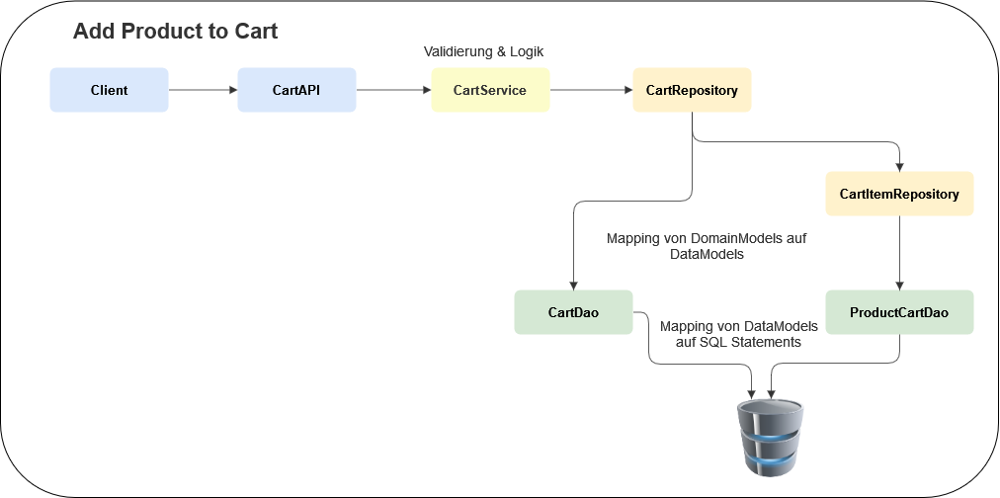

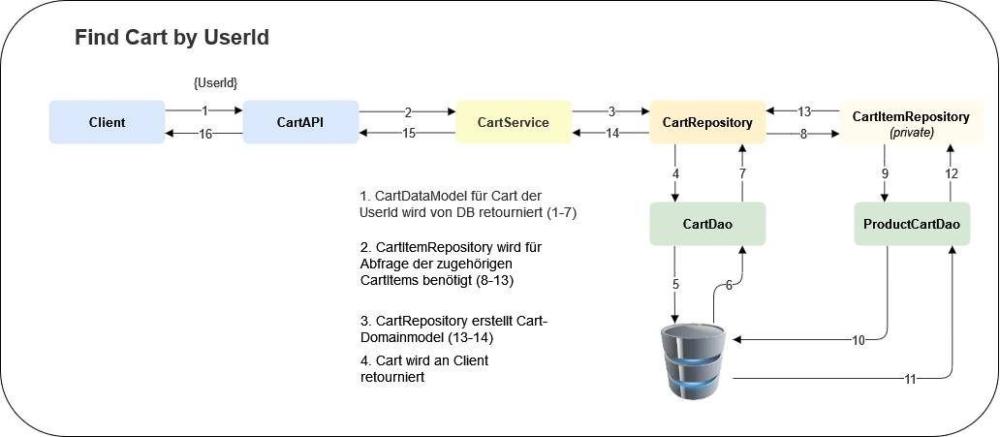

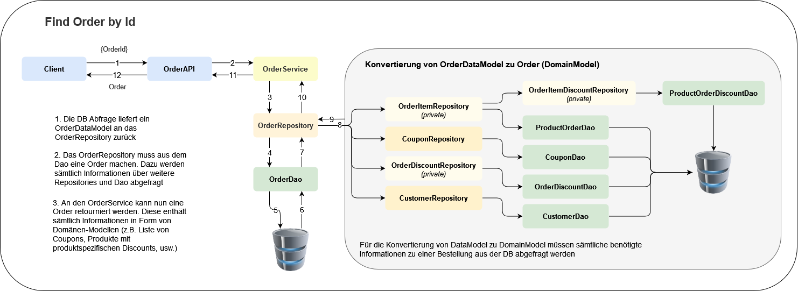

## Entity-Relationship-Modell


### Anmerkungen zum Entity-Relationship-Modell

* Die ShopId wird in jeder Entität gespeichert. So soll sichergestellt werden, dass die Daten von einzelnen Shops sauber getrennt werden können, obwohl diese in einer gemeinsamen DB gespeichert werden.
* Produkte werden nie aus der Datenbank gelöscht werden. Stattdessen wird eine „deleted“ Flag gesetzt. Dadurch kann sichergestellt werden, dass das „Löschen“ eines Produkts keinen Einfluss auf bestehende Warenkörbe und Bestellungen hat.
* In der Assoziationstabelle product_order wird der Preis pro Stück gespeichert. Somit hat eine Preisänderung eines Produkts (oder das Löschen eines Produkts) keinen Einfluss auf den Wert der getätigten Bestellung.
* In der Assoziationstabelle product_cart wird der Preis pro Stück NICHT gespeichert. Eine Preisänderung soll sich durchaus auf einen bestehenden Warenkorb auswirken
* Ein Coupon ist einem Shop zugeordnet. Wir haben es so definiert, dass ein Coupon maximal einem Warenkorb zugeteilt sein kann und natürlich nur einer Bestellung.
* Ein Coupon kann gleichzeitig nur einem Warenkorb ODER einer Bestellung zugeordnet sein.
* Sobald eine Bestellung getätigt wird, werden die Daten aus den Tabellen cart und product_cart gelöscht und stattdessen in die Tabellen order und product_order überführt.
* Um Warenkörbe nach einer bestimmten Zeit löschen zu können, benötigt jeder Shop eine globale Konfiguration für die Bestanddauer von (verwaisten) Warenkörben (cart_lifetime_minutes). Im Cart wird der letzte Zugriff gespeichert.
* Die CustomerId in einem Cart darf auch null sein. Somit können „anonyme“ Kunden Warenkörbe anlegen, die ihre Daten erst bei Bestellabschluss angeben müssen (und sich somit registrieren).
* Rabatt-Optionen (Aktionen und Parameter) werden hardcoded im Backend angelegt. In der DB wird aber gespeichert, welche Konfiguration es in einem Shop gibt. Über zwei JSON Felder (rule und action parameters) werden die konkreten Werte der Rabattregeln gespeichert.
  * Z.B. lt. Backend gibt es die Regel: „Kaufe um X € ein“ und die Aktion „erhalte Y% auf deinen Einkauf“. Der User kann die Werte X und Y über die JSON Parameter setzen. Also z.B. „Kaufe um 50 € ein“, „erhalte 10% auf deinen Einkauf“.
* Die Rabattregeln (discount_setting) werden global auf alle Warenkörbe und Bestellungen eines Shops angewendet.
* Bei Rabatten unterscheiden wir zwischen solchen, die auf einzelne Bestellitems angewendet werden können (product_order_discount) und solchen, die auf die komplette Bestellung angewendet werden (order_discount)
  * z.B. einzelne Bestellitems: Bestelle um 50 € und erhalte das teuerste Produkt gratis
  * z.B. gesamte Bestellung: Bestelle um 50 € und erhalte einen Gutschrift von 10 €

Die Anforderungen an die Testdaten wurden wie beschrieben umgesetzt:

2 Shops

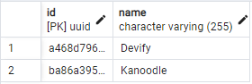

100 Produkte ja Shop

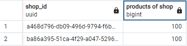

100 Kunden ja Shop


Durchschnittlich 10 Bestellungen je KundIn

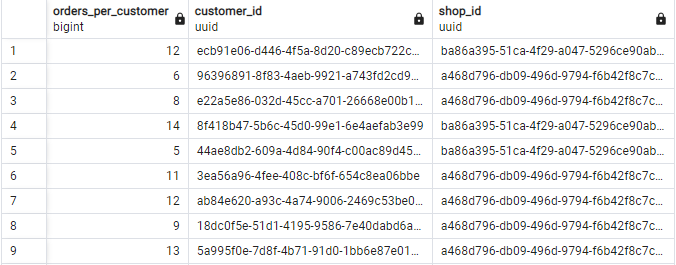
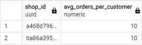

Durchschnittlich 3 Produkte je Bestellung

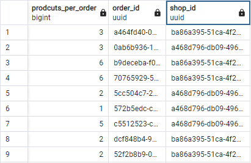
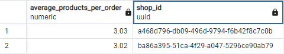

Mindestens 10 Kunden mit offenem Warenkorb

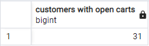

<div style="page-break-after: always;"></div>

## API
Wir haben die API wie gefordert sehr schmal gehalten. Sämtliche Businesslogik ist an das CaaS-Core Projekt ausgelagert. 
Der Fluss der Anfragen ist wie beschrieben folgender: API -> Service -> Repository -> Dao. 
Die Controller haben wir nach den "Aufgabenbereichen" aufgeteilt. D.h. es gibt Controller für die Cart-Logiken, für die Customer-Logiken, für die Order-Logiken usw. Innerhalb der Bereiche gibt es - wo sinnvoll - zwei Controller. 
Einen, der Anfragen abwickelt, die den Admin betreffen (für die man authentifiziert sein muss) sowie einen weiteren der Anfragen von Usern (ohne Registrierung) abwickelt.

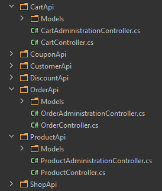

Der Code zeigt einen Ausschnitt aus dem CouponAdministrationController. 
Wie man sieht, erfolgt im Controller das Mapping von Dtos zu den tatsächlichen Datenmodellen. 
Ansonsten werden die Anfragen nur an die jeweiligen Methoden des Services weitergeleitet.

```csharp
[HttpGet("getByCustomerId/{customerId:guid}")]
public async Task<IEnumerable<CouponDto>> GetCouponsByCustomerId(Guid customerId, CancellationToken cancellationToken = default) {
    var coupon = await _couponService.GetCouponsByCustomerId(customerId, cancellationToken);
    return _mapper.Map<IEnumerable<CouponDto>>(coupon);
}

[HttpPut("{couponId:guid}")]
public async Task<CouponDto> UpdateCoupon(Guid couponId, CouponForUpdateDto couponDto, CancellationToken cancellationToken = default) {
    var updatedCoupon = _mapper.Map<Coupon>(couponDto);
    var result = await _couponService.UpdateCoupon(couponId, updatedCoupon, cancellationToken);
    return _mapper.Map<CouponDto>(result);
}

[HttpPost]
public async Task<ActionResult> AddCoupon(CouponForCreationDto couponDto, CancellationToken cancellationToken = default) {
    var coupon = _mapper.Map<Coupon>(couponDto);
    var result = await _couponService.AddCoupon(coupon, cancellationToken);
    
    return CreatedAtAction(
        actionName: nameof(AddCoupon),
        routeValues: new { couponId = result.Id },
        value: _mapper.Map<CouponDto>(result));
}
```
### OpenAPI
Alle Controller APIs werden in eine swagger.json Datei auf Basis der OpenAPI Spezifikation hinzugefügt. Mithilfe des ASP .NET
Swashbuckle Nuget packages können die ASP .NET Metadaten ausgewertet werden, wodurch sehr viele OpenAPI Informationen automatisch
generiert werden können. Da die Erweiterung nicht erkennt, welche möglichen Status Codes zurückgegeben werden können und es sehr
mühsam ist, diese immer wieder anzuführen, haben wir Konventionen eingeführt. Konvention heißt, dass es nur gewisse Arten von APIs
gibt (Get, Create, Update, Delete) die sich alle jedoch ähnlich bis gleich verhalten. Die Web-API-Konventionen die ASP .NET bereits
zur Verfügung stellt, sind zwar bereits sehr mächtig, erfüllten jedoch nicht alle Anforderungen die wir hatten. Daher haben wir einen
OpenAPI IOperationFilter implementiert. Swashbuckle bietet damit eine einfache Möglichkeit, die OpenAPI Generierung zu beeinflussen.
In diesen Filtern werden unsere spezifischen Attribute sowie die standardisierten Attribute ausgewertet. Zusätzlich werden unsere definierten Konventionen in Form von OpenAPI Metadaten angewendet. Hier ein kleiner Auszug des Filters:
```csharp
public class CaasConventionOperationFilter : IOperationFilter {
    ...
    public void Apply(OpenApiOperation operation, OperationFilterContext context) {
        var attribute = context.MethodInfo.GetAttribute<AuthorizeAttribute>();
        if (attribute != null) {
            AddProblemDetailsByStatusCode(StatusCodes.Status401Unauthorized, operation, context);
            AddAppKeySecurity(operation);
        }
        if (ApplyReadFor(operation, context)) return;
        if (ApplyWriteFor(operation, context)) return;

        if (ApplyReadFor<HttpGetAttribute>(operation, context)) return;
        if (ApplyWriteFor<HttpPostAttribute>(operation, context)) {
            Replace200With201(operation);
            return;
        }
        if (ApplyWriteFor<HttpDeleteAttribute>(operation, context)) return;
        if (ApplyWriteFor<HttpPutAttribute>(operation, context)) return;
    }
    ...
}
```

### Error Handling
Um auftretende Exceptions in der API nicht als simplen Stacktrace Text zu retournieren, sondern auch diese strukturiert mit Fehlercode
zurückzugeben haben wir uns für die RFC 7807 Problem Details for HTTP APIs Spezifikation entschieden. Bei Fehler wird hierfür ein
definiertes JSON Objekt zurückgegeben. Da die Fehlerbehandlung im Controlller sehr repititiv sein kann, haben wir hier für eine ASP .NET 
Middleware in Form von dem "Hellang.Middleware.ProblemDetails" nuget packages entschieden. Dies erlaubt ein sehr einfaches Mapping
einer Exception auf bestimmte Fehlercodes und/oder HTTP Status Codes. Hier ein Auszug unseres Mappings:
```csharp
private static void ConfigureProblemDetails(ProblemDetailsOptions options) {
    // log exception in development mode
    options.ShouldLogUnhandledException = (context, _, _) 
        => context.RequestServices.GetRequiredService<IWebHostEnvironment>().IsDevelopment();
    options.MapToStatusCode<NotImplementedException>(StatusCodes.Status501NotImplemented);
    options.MapToStatusCode<HttpRequestException>(StatusCodes.Status503ServiceUnavailable);
    options.MapToStatusCode<CaasUpdateConcurrencyDbException>(StatusCodes.Status409Conflict);
    options.MapToStatusCode<CaasItemNotFoundException>(StatusCodes.Status404NotFound);
    options.MapToStatusCode<CaasNoTenantException>(StatusCodes.Status400BadRequest);

    // Custom mapping function for ValidationException.
    options.Map<CaasValidationException>((ctx, ex) => HandleValidationErrors(ctx, ex.Errors));

    // Because exceptions are handled polymorphically, this will act as a "catch all" mapping, which is why it's added last.
    // If an exception other than NotImplementedException and HttpRequestException is thrown, this will handle it.
    options.MapToStatusCode<Exception>(StatusCodes.Status500InternalServerError);
}
```

### Architektur & App-Key
Für die App-Key Authentifizierung haben wir einen eindeutigen Key pro Shop erzeugt. Administrative API Aufrufe, müssen zusätzlich
zur Mandanten ID, auch einen AppKey als HTTP Header mitsenden. Passt der AppKey nicht zur Mandanten ID, wird der Aufruf abgelehnt.
Da ASP .NET bereits einen Mechanismus zur Authentifzierung bietet, haben wir die AppKey Authentifizierung auf Basis diesen Mechanismus
implementiert. Hierfür muss ein Authentifizierungs Handler implementiert werden, in diesem Fall sieht dieser wie folgt aus:
```csharp
public class AppKeyAuthenticationHandler : AuthenticationHandler<AppKeyAuthenticationOptions> {
    public AppKeyAuthenticationHandler(IOptionsMonitor<AppKeyAuthenticationOptions> options, ILoggerFactory logger,
    UrlEncoder encoder, ISystemClock clock) : base(options, logger, encoder, clock) { }

    protected override async Task<AuthenticateResult> HandleAuthenticateAsync() {
        if (!Request.Headers.TryGetValue(HeaderConstants.AppKey, out var appKey)) {
            return AuthenticateResult.Fail("No app-key provided");
        }
        var appKeyValidator = Context.RequestServices.GetRequiredService<IAppKeyValidator>();
        if (!await appKeyValidator.ValidateAppKeyAsync(appKey)) {
            return AuthenticateResult.Fail("Invalid app-key provided");
        }
        var principal = new ClaimsPrincipal(new ClaimsIdentity(null, Scheme.Name));
        var ticket = new AuthenticationTicket(principal, null, Scheme.Name);
        return AuthenticateResult.Success(ticket);
    }
}
```
Dies hat den Vorteil, dass für AppKey-authentifizierte Controller nur ein Attribut hinzugefügt werden:
```csharp
[Authorize(Policy = AppKeyAuthenticationDefaults.AuthorizationPolicy)]
```
Die Authentifizierung wurde auf eine eigene Policy ausgelagert, um in Zukunft auch andere Authentifizierungsmechanismen zu unterstützen (z.B. OAuth).

## Geschäftslogik

In diesem Abschnitt werden die Hauptkomponenten der Geschäftslogik beschrieben.

### Rabattlogik
Für die Rabatte wurden zwei interaces eingeführt, einmal die Regel:
```csharp
public interface IDiscountRule {
    Task<RuleResult> Evaluate(Cart cart, CancellationToken cancellationToken = default);
}
```
Diese ist dafür zuständig den Einkaufswagen auszuwerten und festzustellen ob die dazugehörige Aktion ausgeführt werden soll oder nicht.
Das Interface für Aktionen sieht hierfür folgendermaßen aus:
```csharp
public interface IDiscountAction {
    Task<Cart> ApplyDiscountAsync(Cart cart, RuleResult triggeredRule, CancellationToken cancellationToken = default);
}
```
Die Regel bekommt wie beschrieben den Einkaufswagen und zusätzliche Infos der Regel, wie z.B. ob die Aktion auf den ganzen Warenkorb oder
nur auf einzelne Artikel angewendet werden soll. Die Aktion muss dann einen neuen Warenkorb liefern (immutability) welcher dann die
entsprechenden Aktionen berücksichtigt.

Um das Entwickeln neuer Regeln und Aktionen so komfortabel wie möglich zu gestalten, haben wir uns ein System auf Basis von Dependency
Injection überlegt. Regeln und Aktionen müssen dem System zuerst bekannt gemacht werden:
```csharp
services.AddDiscountRule<MinProductCountDiscountRule, MinProductCountSettings>(MinProductCountDiscountRule.Id);
services.AddDiscountRule<TimeWindowDiscountRule, TimeWindowDiscountSettings>(TimeWindowDiscountRule.Id);
services.AddDiscountRule<CompositeDiscountRule, CompositeDiscountRuleSettings>(CompositeDiscountRule.Id);
services.AddDiscountAction<PercentageDiscountAction, PercentageDiscountSettings>(PercentageDiscountAction.Id);
services.AddDiscountAction<FixedValueDiscountAction, FixedValueDiscountSettings>(FixedValueDiscountAction.Id);
services.AddDiscountAction<AndDiscountAction, AndDiscountActionSettings>(AndDiscountAction.Id);
```
Jede Regel und Aktion muss eine eindeutige Guid liefern die die Regel bzw. Aktion eindeutig identifiziert.
Außerdem muss bekannt gemacht werden durch welchen C# (CLR) Typ die Regel oder Aktion konfiguriert werden kann.
Dadurch kann vom Fontend auch abgefragt werden, welche Einstellungsmöglichkeiten für welche Aktion/Regel zur Verfügung stehen
und durch welche Typen die jeweiligen Einstellungen repräsentiert werden (int, double, string, bool, ...).
Durch die Registierung stehen all diese Metadaten zur Verfügung. Da jedoch die Regeln und Aktionen dynamisch mit unterschiedlichen
Einstellungen erstellt werden können, stehen die konkreten Instanzen einer Regel bzw. Aktion zur Laufzeit nicht zur verfügung.
Zur Verfügung steht lediglich die Logik, sowie der Datentyp für die Einstellungen. Wenn im Frontend Regeln bzw. Aktionen erstellt
werden, werden diese im Backend zuerst validiert und danach in die Datenbank eingetragen. Da die Einstellungen der jeweiligen Regeln
und Aktionen sehr unterschiedlich sein können und das Hinzufügen von neuen Regeln und Aktionen zu keiner Datenbankschema-Änderung
führen soll, werden diese in Form von JSON bzw. BSON (Binary JSON) eingetragen. Die Verknüpfung zur jeweiligen Logik findet 
über die vorher erwähnten IDs statt.
Wenn ein Einkaufwagen auf Rabatte überprüft werden soll, werden alle in der Datenbank vorhandenen Rabatte abgerufen und aus den
jeweiligen JSON Einstellungen konkrete C# Objektinstanzen erzeugt. Anhand der verknüpften IDs von Regel und Aktionen kann die
C# Klasse ausfindig gemacht werden die die entsprechende Logik enthält. Diese Klassen werden dann mithilfe von Reflection erstellt
und auch die zur Klasse gehörende konkrete Einstellungsklasse wird injiziert. Es besteht keine Restriktion, welche Klassen in den
Konstruktoren der Logik aufgeführt werden dürfen, solange es sich entweder um eine Einstellungsklasse oder um Klassen im 
Dependency Injection Container handelt. Dies könnte dann wie folgt aussehen:
```csharp
public class TimeWindowDiscountRule : IDiscountRule {
    public static readonly Guid Id = new Guid("0F4E0B04-E32B-4897-804C-92F858468D8A");

    private readonly TimeWindowDiscountSettings _settings;
    private readonly ISystemClock _timeProvider;

    public TimeWindowDiscountRule(IDiscountOptions<TimeWindowDiscountSettings> settings, ISystemClock timeProvider) {
        _timeProvider = timeProvider;
        _settings = settings.Value;
    }
    ...
}
```
Durch diese Mechanismus fühlen sich .NET Entwickler gut aufgehoben, da sehr viele Mechanismen (wie z.B. Controller in ASP .NET) so
funktionieren. Die Implementierung beschränkt sich dadurch auf nur sehr wenige Zeilen Code und der Großteil der Arbeit wird vom Framework
abgenommen.

Die konkreten Regeln und Aktionen wurden wie folgt abgebildet:

Um möglichst flexibel zu sein und Kombinationen von verschiedenen Regeln zu erlauben, haben wir die sogenannte CompositeRule eingeführt. Innerhalb dieser ist es wiederrum möglich verschiedene Regeln unter Berücksichtigung einer bestimmten Verknüpfung (und/oder) zu kombinieren. Die Regeln auf Einzelebene sind die TimeWindowDiscountRule sowie die MinProductCountDiscountRule. Sofern ein Cart im definierten Zeitraum existiert, wird die TimeWindowDiscountRule angewendet. Damit die MinProductCountRule zieht, muss von einem bestimmten Produkt eine Mindestbestellmenge im Cart liegen.

Hinsichtlich der auszuführenden Actions habe wir eine AndDiscountAction eingeführt, die es erlaubt, einzelne Aktionen zu kombinieren. Die einzelnen Actions sind die PercentageDiscountAction sowie die FixedValueDiscountAction. Wie der Name schon sagt, wird entweder ein prozentueller oder ein fixer Betrag abgezogen, falls eine Regel die Aktion triggered.

### Bezahlsystem

Für das Bezahlsystem wurde eine Third-Party-Applikation nachgemacht ("gemocked"). Die Applikation haben wir SwKo.Pay benannt. Die Schnittstellendefinition der Anwendung findet sich im Projekt SwKo.Pay.Api. Wir haben versucht uns bei dem Design etwas an dem populären Bezahldienst "stripe" zu orientieren. Grundsätzlich werden von dem Service 3 Methoden angeboten.

```csharp
public interface IPaymentService {
    
    Task<Guid> RegisterPayment(Customer customer, decimal amount, Currency currency);
    
    Task ConfirmPayment(Guid paymentId);
    
    Task RefundPayment(Guid paymentId);

}
```

* RegisterPayment -> jede Zahlung muss zuerst "angemeldet" werden
* Confirm Payment ->  Wenn auf Seiten der zugreifenden Geschäftslogik keine Fehler aufgetreten sind, kann die Zahlung bestätigt werden. Erst dann wird der Betrag abgebucht
* RefundPayment -> Zahlungen die erst registriert wurden aber noch nicht bestätigt sind, können so rückgängig gemacht werden.

Wie bei stripe auch gibt es verschiedene Datenobjekte. Z.B. einen SwKo.Pay Customer (nicht zu verwechseln mit einem Customer aus dem CaaS Projekt). Ein SwKo.Pay Customer kann Metadaten enthalten (Key-Value Storage) welcher z.B. die CustomerId aus CaaS beinhalten könnte. Für den Benutzer nicht sichtbar gibt es intern weitere Model-Klassen wie "Payment" oder "CreditCard". Für eine Kreditkarte ist jeweils die Nummer, der Status (aktiv oder inaktiv) sowie der aktuell verfügbare Kredit hinterlegt.

Weiters gibt es verschiedene Exceptions die im Fehlerfall geschmissen werden. Z.B. wird überprüft ob die Kreditkartennummer valide ist. Diese Prüfung erfolgt über einfaches Patternmatching und sollte in der Praxis natürlich anders gelöst werden. Weitere Fehlerfälle können sein, dass die Kreditkarte nicht mehr aktiv ist (z.B. gestohlen gemeldet) oder der verfügbare Kredit nicht für die zu bezahlende Summe ausreicht.

Die Implementierung des Services ist wie verlangt nur gemocked. Das heißt, im Speicher sind hardcoded Kreditkarten hinterlegt. Damit in CaaS-Projekt Zahlungen erfolgreich sind, sollte man also die hier zuletzt aufgeführte Kreditkarte verwenden.

```csharp
//Invalid card number
CreditCardsDict.Add("9999999999999999", new CreditCard(){CreditCardNumber = "9999999999999999", Active = true, Credit = (decimal)500.10});

//Valid card but inactive (e.g. because lost or expired)
CreditCardsDict.Add("4594233824721535", new CreditCard(){CreditCardNumber = "4594233824721535", Active = false, Credit = (decimal)487.94});

//Valid, active card with little credit
CreditCardsDict.Add("5349801875979163", new CreditCard(){CreditCardNumber = "5349801875979163", Active = true, Credit = (decimal)2.20});

//Valid, active card with large credit
CreditCardsDict.Add("4405100664466647", new CreditCard(){CreditCardNumber = "4405100664466647", Active = true, Credit = (decimal)10000.00});
```
Zur Simulation, dass eine Zahlung länger dauern kann, wurde in der Methode RegisterPayment ein Task Delay von 2 Sekunden eingebaut.

#### Verwendung von SwKo.Pay im CaaS Projekt
Im OrderService gibt es die Methode CreateOrderFromCart. Wie der Name bereits sagt, wird dabei ein Cart in eine Order überführt. Im Zuge dieses Methodenaufrufs wird auf den PaymentService SwKo zugegriffen. Es wird eine Zahlung über die Summe des Carts registriert. Dann werden in einer Transaktion alle DB-Operationen ausgeführt, die für die Überführung eines Carts in eine Order benötigt werden. Sofern keine CaaS-Exception geworfen wird, wird die Zahlung bestätigt. Falls eine CaaS-Exception geworfen wird, wird im Catch-Block RefundPayment aufgerufen. Mögliche SwKo.Pay-Exceptions werden auf CaaS-Exceptions gemapped.

### Statistikservice
Der Statistikservice liefert Statistiken zum meistverkauften Produkt sowie Summen und Durchschnittswerte von Bestellungen und Einkaufskörben in einem bestimmten Zeitraum. Teilweise kann auch ausgewählt werden, wonach aggregiert werden soll (Tag, Monat oder Jahr). Das kann im Frontend für Zeitreihenanalysen relevant sein.

Wir haben uns dazu entschieden, die Abfragen direkt auf der Datenbank zu machen. D.h. wir erhalten bereits das gewünschte Ergebnis fertig aufbereitet und aggregiert von der Datenbankabfrage zurück. Der Vorteil davon ist, dass keine großen Datenmengen in den Speicher geladen werden müssen. Außerdem ersparen wir uns dann möglicherweise mehrmaliges Iterieren über die Daten im Backend. Der Nachteil ist, dass wir eventuell etwas unflexibler sind, da die Daten eben genau in einer bestimmten Form geliefert werden. D.h. für jede konkrete Anforderung benötigt es eine DB-Anfrage (auch einer Methode und u.U einen bestimmten Rückgabetyp)

## Testing

Die Datenzugriffsschicht testen wir mittels Integration-Tests. Vor jedem Test wird dazu ein Container (mit Testcontainers for .NET) hochgefahren und darin wird eine Datenbank mit Testdaten instanziert. Dadurch können wir die DAOs mit einem echten Datenbankzugriff testen.

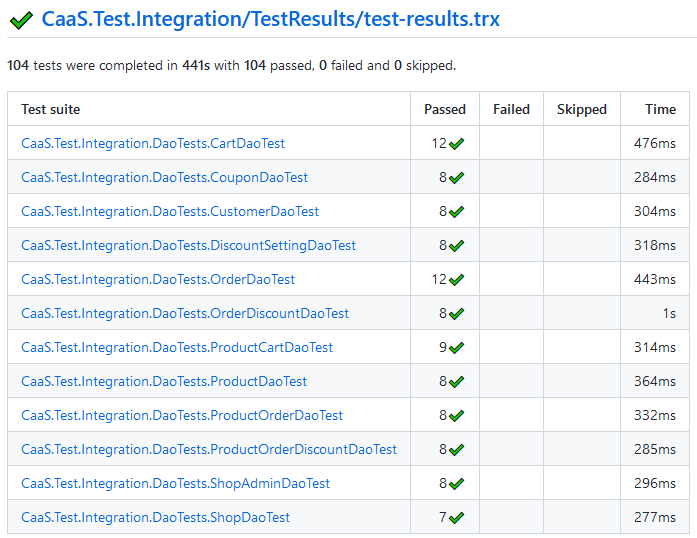

Repositories und Services haben wir auf Basis von Unit-Tests getestet. Die Daos mocken wir mittels einer selbst implementierten MemoryDao Klasse weg (diese implementiert das IDao Interface).

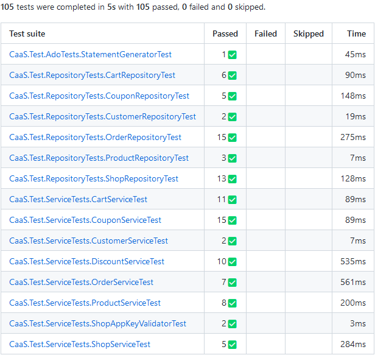

Die Tests decken einen Großteil des Infrastructure (Implementierung der Repositories und Services) und des Core Projekts (Interfaces, Domainmodels etc.) ab. Wie man in den Screenshots sieht liegt die Testabdeckung bei den einzelnen Aggregaten (Shop, Cart, Customer,...) bei ca. 90%. Insgesamt liegt die Testabdeckung für diese Projekt bei einem geringeren Anteil weil Codestücke wie Automapper, Dependency Injection usw. gibt, die von den Tests nicht abgedeckt sind.

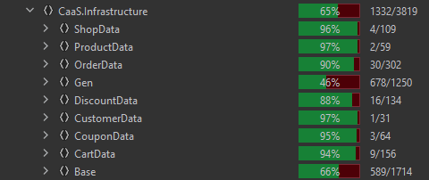
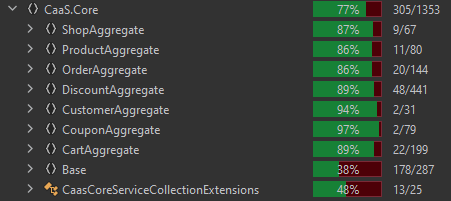

## Entwicklung im Team
Wie in der Angabe gefordert haben wir Maßnahmen gesetzt, um die Entwicklung im Team zu vereinfachen. Eine der Maßnahmen war es Tickets für einzelne Arbeitspakete zu erstellen, die dann einem Teammitglied zugeteilt wurden. Über das Kanban-Board in GitHub konnte so der Fortschritt der einzelnen Tickets verfolgt werden.

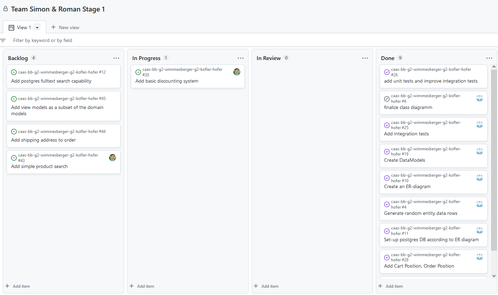

Für einzelne Tickets wurden im Regelfall Branches erstellt, welche wieder in Main gemerged wurden, nachdem der Merge-Request vom Reviewer akzeptiert wurde. So erfolgte auch ein großer Anteil unserer Kommunikation über GitHub und Merge-Requests. Zusätzlich haben wir uns regelmäßig über Teams über den aktuellen Fortschritt, neue ToDos sowie etwaige Diskussionspunkte ausgetauscht.

Für automatische Builds haben wir zwei Workflows definiert. Einer baut ein .NET Projekt der andere baut ein Docker-Image welches dann zur einfachen Verteilung unserer Lösung verwendet werden kann.

<div style="page-break-after: always;"></div>

## Verteilung des Systems
Die Anwendung sowie die Datenbank haben wir mittels Docker Compose dockerisiert. Sobald die Container hochgefahren werden, ist die Anwendung samt DB und befüllten Testdaten (würde man in der Realität nicht machen) verfügbar.


