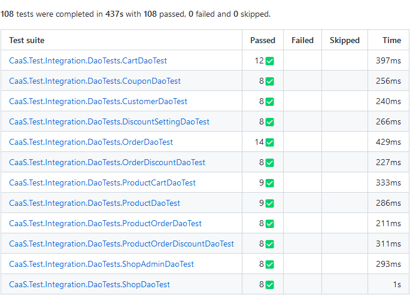

# CaaS Projektarbeit - Ausbaustufe 1

Roman Kofler-Hofer (S2010307022)

Simon Wimmesberger (S2010307046)

<div style="page-break-after: always;"></div>

## Softwarearchitektur
Die Softwarearchitektur von CaaS basiert auf Domain-driven Design mit einer klassichen
Zwiebelarchitektur.


Das CaaS.Api Projekt bildet hierbei die Präsentationsschicht, hier befindet sich die REST-API
mit OpenAPI Spezifikation.
Das CaaS.Core Projekt bildet den Service und Domain Layer. 
Daher befinden sich dort unsere Domain Objekte (Cart, Order, Customer, ...), die Repository Interfaces
und die Service Interfaces sowie deren Implementierung.
Die Services haben nur eine Abhängigkeit auf die Repository Interfaces.

Die Implementierungen der Repository Interfaces befinden sich im CaaS.Infrastructure
Projekt, welches sich auf der Infrastrukturschicht befindet. 
Diese Schicht bildet damit die Implementierung der Datenzugriffsschicht.
Als Persistierung wird PostgreSQL 15 verwendet, da es sich hier um eine freie und sehr mächtige Datenbank handelt.

### Datenzugriffsschicht

Bei der Datenzugriffsschicht werden verschiedene Entwurfsmuster eingesetzt:
* AdoTemplate
* UOW (UnitOfWork)
* Data Access Object (DAO)
* Repository

Bei einem Repository handelt es sich in unserem Fall um eine Klasse die mit Domainobjekten arbeitet.
Bei den DAOs handelt es sich um Klassen die für einzelne Datenbank Tabellen Einträge liefern können.
Diese DAOs werden ausschließlich von Repositories verwendet, um Domainobjekte zu erstellen.
Da die Verwendung eines ORM wie Entity Framework nicht erlaubt ist, konnte so durch den Einsatz
von DAOs das mappen von mehreren Tabellen auf ein Domainobjekt vereinfacht werden.


Da es sich beim Mappen von einzelnen Zeilen einzelner Tabellen um eine sehr repitetive Aufgabe handelt,
haben wie hierfür eine generische Implementierung erstellt. Für jede Tabelle muss ein
Datenhaltungsobjekt erstellt werden, welches die Spalten einer Tabelle beschreibt.
Hierbei setzen wir das Konvention vor Konfiguration Paradigma ein. 
Daher muss das Property in der Datenmodellklasse in PascalCase zur jeweiligen snake_case Spalte in der Datenbank passend angelegt werden.
Als Beispiel, folgende SQL Definition einer Tabelle:
```sql
CREATE TABLE "shop_admin" (
    "id" uuid DEFAULT  gen_random_uuid() PRIMARY KEY,
    "row_version" int DEFAULT 0,
    "creation_time" timestamp WITH TIME ZONE DEFAULT CURRENT_TIMESTAMP, -- this is only UTC in postgres
    "last_modification_time" timestamp WITH TIME ZONE DEFAULT CURRENT_TIMESTAMP,
    "shop_id" uuid NOT NULL,
    "name" varchar(255) NOT NULL,
    "email" varchar(255) UNIQUE NOT NULL
);
```
Muss als Datenmodellklasse so aussehen:
```csharp
[GenerateMapper]
public record ShopAdminDataModel {
    public Guid Id { get; init; }
    // concurrencyToken
    public int RowVersion { get; init; }
    public DateTimeOffset CreationTime { get; init; }
    public DateTimeOffset LastModificationTime { get; init; }
    
    public Guid ShopId { get; init; } = default;
    public string Name { get; init; } = string.Empty;
    public string Email { get; init; } = string.Empty;
}
```

Dieses generische Mapping zwischen einer Datenbankzeile zu einem Datenmodell Objekt könnte über verschiedene
Wege realisiert werden:
* Reflection (Klassisch)
* Expression Code Generation (Performanter wie Reflection aber komplizierter)
* Code Generation (Neuer Ansatz)

Da sich in der Standardbibliothek von .NET auch ein Trend zur Generierung von repitetiven Code ableiten lässt (System.Text.Json, Regex Source Generator, ...),
haben wir für das Datenmapping auch damit experimentiert.
Ziel hierbei war es einen Roslyn Source Generator zu schreiben, der auf Basis der Datenmodellklasse einen Mapper erzeugt,
der aus einem IDataRecord (Ado .NET) eine Instanz der Datenmodellklasse erzeugt.
Der Code dieses Source Generators liegt im CaaS.Infrastructure.Generator Projekt.
Der generierte Code sieht dann ähnlich wie folgt aus:
```csharp
[GeneratedCode(tool: "CaaS.Infrastructure.Generator", version: "1.2.0.0")]
public sealed class ShopAdminDataRecordMapper : IDataRecordMapper<ShopAdminDataModel>{
    public Type MappedType { get; } = typeof(ShopAdminDataModel);
    
    public string MappedTypeName { get; } = "shop_admin";
    
    private readonly IPropertyMapper _propertyMapper = new ShopAdminPropertyToColumnMapper();
    private readonly IPropertyMapper _columnMapper = new ShopAdminColumnToPropertyMapper();
    
    public IPropertyMapper ByColumName() => _columnMapper;
    
    public IPropertyMapper ByPropertyName() => _propertyMapper;
    
    public async ValueTask<ShopAdminDataModel> EntityFromRecordAsync(DbDataReader record, CancellationToken cancellationToken = default) {
        return new ShopAdminDataModel {
            ShopId = await record.GetValueAsync<Guid>("shop_id", cancellationToken),
            Name = await record.GetValueAsync<string>("name", cancellationToken),
            EMail = await record.GetValueAsync<string>("e_mail", cancellationToken),
            Id = await record.GetValueAsync<Guid>("id", cancellationToken),
            RowVersion = await record.GetValueAsync<int>("row_version", cancellationToken),
            CreationTime = await record.GetValueAsync<DateTimeOffset>("creation_time", cancellationToken),
            LastModificationTime = await record.GetValueAsync<DateTimeOffset>("last_modification_time", cancellationToken),
        };
    }

    public IRecord RecordFromEntity(ShopAdminDataModel record) 
        => new ShopAdminRecord(record, this);
}
```
Diese generierten Mapper werden automatisch in den Dependency Injection Container injeziert
und stehen somit dem GenericDao zur Verfügung.
Aus Architektursicht sind der Generator und die Dao ein reines Implementierungsdetail der Repositories. 
Daher erleichtern sie dem Entwickler die Wartung und Erweiterung von Repositories, da der Zugriff auf die Datenbank erleichtert wird.

Für die Erzeugung der Datenbankstruktur haben wir auf SQL-Dateien gesetzt (Database first). 
Deshalb gibt es im Infrastrukturprojekt einen Ordner mit SQL-Dateien die einmalig manuell auf die
Datenbank angewendet werden müssen. Die Datenmodellklasse könnte man theoretisch auf Basis der
SQL-Dateien bzw. Datenbank automatisch generieren (Database First) oder die SQL-Datei auf Basis
der Modelle (Code First), dies war für dieses Projekt aber out-of-scope.
Eine Änderung in der Datenbankstruktur in der SQL-Datei muss entsprechend auch auf die
Datenmodellklasse angewandt werden und umgekehrt.

### Mehrmandantenfähigkeit
Da mit einer einzelnen Anwendung mehrere Shops bedient werden sollen, haben wir diese Fähigkeit direkt von vornherein berücksichtigt.
In allen Tabellen (außer shop, shop_admin) wurde dazu eine Spalte shop_id eingeführt, die die jeweiligen Daten immer einen spezifischen Shop (Mandant) zuordnet.
Bei einer Abfrage der Daten muss daher immer der aktuelle Mandant berücksichtigt werden, daher dürfen die Repositories nur Daten zu dem jeweiligen Shop der vom Client
gerade verwendet wird liefern. Die Berücksichtigung des Tenants wird direkt im DAO (GenericDao) Layer erledigt. Dieser muss jedoch wissen welche Spalte in der Tabelle
den Mandanten (shop_id) beinhaltet. Dies haben wir über Attribute gelöst:
```csharp
[GenerateMapper]
public record ProductDataModel {
    [TenantIdColumn]
    public Guid ShopId { get; init; }
    ...
}
```
Durch die Kennzeichnung des Mandanten in der Datenmodellklasse können die SQL-Abfragen immer um diese Mandantenspalte erweitert werden und somit effizient abgefragt werden.
Die Frage ist, wie wird vom Client der verwendete Shop (Mandant), mitgeteilt und über die Schichten weitergegeben?
Damit die tenantId nicht in jeder Methode in jeder Schicht mitgeschliffen werden muss, was die API unnötig aufbläst, haben wir ein Interface eingeführt, welches vom generischen
Dao aus verwendet wird:
```csharp
public interface ITenantIdAccessor {
    bool TryGetTenantId([MaybeNullWhen(false)] out string tenantId);
}
```

Eine Implementierung dieses Interfaces, muss dem Verwender die ShopId (tenantId) des aktuellen Aufrufs zur Verfügung stellen. Diese tenantId wird dann in der SQL-Abfrage verwendet.
In unserem Fall wird die TenantId über einen HTTP-Header (X-tenant-id) vom Aufrufer zur Verfügung gestellt, daher sieht unsere Implementierung wie folgt aus:
```csharp
public class HttpTenantIdAccessor : ITenantIdAccessor {
    private readonly HttpContext? _httpContext;

    public HttpTenantIdAccessor(IHttpContextAccessor contextAccessor) {
        _httpContext = contextAccessor.HttpContext;
    }

    public bool TryGetTenantId([MaybeNullWhen(false)] out string tenantId) {
        if (_httpContext == null) {
            tenantId = default;
            return false;
        }
        if (!_httpContext.Request.Headers.TryGetValue(HeaderConstants.TenantId, out var tenantIdVals)) {
            tenantId = default;
            return false;
        }
        var opTenantId = tenantIdVals.FirstOrDefault();
        if (opTenantId == null) {
            tenantId = default;
            return false;
        }
        tenantId = opTenantId;
        return true;
    }
}
```
Wird die TenantId vom Aufrufer nicht gesetzt, wird dem Client eine Fehlermeldung angezeigt.

## Programmstruktur - Ablaufdiagramm
Exemplarisch haben wir 3 Ablaufdiagramme für komplexe Abläufe in der Anwendung dargestellt.


## Entity-Relationship-Modell


### Anmerkungen zum Entity-Relationship-Modell

* Die ShopId wird in jeder Entität gespeichert. So soll sichergestellt werden, dass die Daten von einzelnen Shops sauber getrennt werden können, obwohl diese in einer gemeinsamen DB gespeichert werden.
* Produkte werden nie aus der Datenbank gelöscht werden. Stattdessen wird eine „deleted“ Flag gesetzt. Dadurch kann sichergestellt werden, dass das „Löschen“ eines Produkts keinen Einfluss auf bestehende Warenkörbe und Bestellungen hat.
* In der Assoziationstabelle product_order wird der Preis pro Stück gespeichert. Somit hat eine Preisänderung eines Produkts (oder das Löschen eines Produkts) keinen Einfluss auf den Wert der getätigten Bestellung.
* In der Assoziationstabelle product_cart wird der Preis pro Stück NICHT gespeichert. Eine Preisänderung soll sich durchaus auf einen bestehenden Warenkorb auswirken
* Ein Coupon ist einem Shop zugeordnet. Wir haben es so definiert, dass ein Coupon maximal einem Warenkorb zugeteilt sein kann und natürlich nur einer Bestellung.
* Ein Coupon kann gleichzeitig nur einem Warenkorb ODER einer Bestellung zugeordnet sein.
* Sobald eine Bestellung getätigt wird, werden die Daten aus den Tabellen cart und product_cart gelöscht und stattdessen in die Tabellen order und product_order überführt.
* Um Warenkörbe nach einer bestimmten Zeit löschen zu können, benötigt jeder Shop eine globale Konfiguration für die Bestanddauer von (verwaisten) Warenkörben (cart_lifetime_minutes). Im Cart wird der letzte Zugriff gespeichert.
* Die CustomerId in einem Cart darf auch null sein. Somit können „anonyme“ Kunden Warenkörbe anlegen, die ihre Daten erst bei Bestellabschluss angeben müssen (und sich somit registrieren).
* Rabatt-Optionen (Aktionen und Parameter) werden hardcoded im Backend angelegt. In der DB wird aber gespeichert, welche Konfiguration es in einem Shop gibt. Über zwei JSON Felder (rule und action parameters) werden die konkreten Werte der Rabattregeln gespeichert.
  * Z.B. lt. Backend gibt es die Regel: „Kaufe um X € ein“ und die Aktion „erhalte Y% auf deinen Einkauf“. Der User kann die Werte X und Y über die JSON Parameter setzen. Also z.B. „Kaufe um 50 € ein“, „erhalte 10% auf deinen Einkauf“.
* Die Rabattregeln (discount_setting) werden global auf alle Warenkörbe und Bestellungen eines Shops angewendet.
* Bei Rabatten unterscheiden wir zwischen solchen, die auf einzelne Bestellitems angewendet werden können (product_order_discount) und solchen, die auf die komplette Bestellung angewendet werden (order_discount)
  * z.B. einzelne Bestellitems: Bestelle um 50 € und erhalte das teuerste Produkt gratis
  * z.B. gesamte Bestellung: Bestelle um 50 € und erhalte einen Gutschrift von 10 €

Die Anforderungen an die Testdaten wurden wie beschrieben umgesetzt:

2 Shops


100 Produkte ja Shop


100 Kunden ja Shop


Durchschnittlich 10 Bestellungen je KundIn


Durchschnittlich 3 Produkte je Bestellung


Mindestens 10 Kunden mit offenem Warenkorb


<div style="page-break-after: always;"></div>

## Testing

Die Datenzugriffsschicht testen wir mittels Integration-Tests. Vor jedem Test wird dazu ein Container (mit Testcontainers for .NET) hochgefahren und darin wird eine Datenbank mit Testdaten instanziert. Dadurch können wir die DAOs mit einem echten Datenbankzugriff testen.



Bereits bestehende Unit-Tests betreffen eher die Businesslogik (Services, Repositories) und werden auf Basis von in-memory Testdaten durchgeführt.


## Entwicklung im Team
Wie in der Angabe gefordert haben wir Maßnahmen gesetzt, um die Entwicklung im Team zu vereinfachen. Eine der Maßnahmen war es Tickets für einzelne Arbeitspakete zu erstellen, die dann einem Teammitglied zugeteilt wurden. Über das Kanban-Board in GitHub konnte so der Fortschritt der einzelnen Tickets verfolgt werden.


Für einzelne Tickets wurden im Regelfall Branches erstellt, welche wieder in Main gemerged wurden, nachdem der Merge-Request vom Reviewer akzeptiert wurde. So erfolgte auch ein großer Anteil unserer Kommunikation über GitHub und Merge-Requests. Zusätzlich haben wir uns regelmäßig über Teams über den aktuellen Fortschritt, neue ToDos sowie etwaige Diskussionspunkte ausgetauscht.

Für automatische Builds haben wir zwei Workflows definiert. Einer baut ein .NET Projekt der andere baut ein Docker-Image welches dann zur einfachen Verteilung unserer Lösung verwendet werden kann.

<div style="page-break-after: always;"></div>
