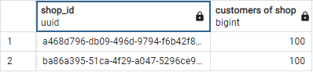

# CaaS Projektarbeit - Ausbaustufe 1

Roman Kofler-Hofer (S2010307022)

Simon Wimmesberger (S2010307046)

## Entwicklung im Team
Wie in der Angabe gefordert haben wir Maßnahmen gesetzt, um die Entwicklung im Team zu vereinfachen. Eine der Maßnahmen war es Tickets für einzelne Arbeitspakete zu erstellen, die dann einem Teammitglied zugeteilt wurden. Über das Kanban-Board in Github konnte so der Fortschritt der einzelnen Tickets verfolgt werden. 

Für einzelne Tickets wurden im Regelfall Branches erstellt, welche wieder in Main gemerged wurden, nachdem der Merge-Request vom Reviewer akzeptiert wurde. So erfolgte auch ein großer Anteil unserer Kommunikation über Github und Merge-Requests. Zusätzlich haben wir uns regelmäßig über Teams über den aktuellen Fortschritt, neue ToDos sowie etwaige Diskussionspunkte ausgetauscht. 

Für automatische Builds haben wir zwei Workflows definiert. Einer baut ein .NET Projekt der andere baut ein Docker-Image welches dann zur einfachen Verteilung unserer Lösung verwendet werden kann.

## Klassendiagramm

### Anmerkungen zum Klassendiagramm

* Die ShopId wird in jeder Entität gespeichert. So soll sichergestellt werden, dass die Daten von einzelnen Shops sauber getrennt werden können, obwohl diese in einer gemeinsamen DB gespeichert werden.
* Produkte werden nie aus der Datenbank gelöscht werden. Stattdessen wird eine „deleted“ Flag gesetzt. Dadurch kann sichergestellt werden, dass das „Löschen“ eines Produkts keinen Einfluss auf bestehende Warenkörbe und Bestellungen hat.
* In der Assoziationstabelle product_order wird der Preis pro Stück gespeichert. Somit hat eine Preisänderung eines Produkts (oder das Löschen eines Produkts) keinen Einfluss auf den Wert der getätigten Bestellung.
* In der Assoziationstabelle product_cart wird der Preis pro Stück NICHT gespeichert. Eine Preisänderung soll sich durchaus auf einen bestehenden Warenkorb auswirken
* Ein Coupon ist einem Shop zugeordnet. Wir haben es so definiert, dass ein Coupon maximal einem Warenkorb zugeteilt sein kann und natürlich nur einer Bestellung.
* Ein Coupon kann gleichzeitig nur einem Warenkorb ODER einer Bestellung zugeordnet sein.
* Sobald eine Bestellung getätigt wird, werden die Daten aus den Tabellen cart und product_cart gelöscht und stattdessen in die Tabellen order und product_order überführt.
* Um Warenkörbe nach einer bestimmten Zeit löschen zu können, benötigt jeder Shop eine globale Konfiguration für die Bestanddauer von (verwaisten) Warenkörben (cart_lifetime_minutes). Im Cart wird der letzte Zugriff gespeichert.
* Die CustomerId in einem Cart darf auch null sein. Somit können „anonyme“ Kunden Warenkörbe anlegen, die ihre Daten erst bei Bestellabschluss angeben müssen (und sich somit registrieren).
* Rabatt-Optionen (Aktionen und Parameter) werden hardcoded im Backend angelegt. In der DB wird aber gespeichert, welche Konfiguration es in einem Shop gibt. Über zwei JSON Felder (rule und action parameters) werden die konkreten Werte der Rabattregeln gespeichert.
  * Z.B. lt. Backend gibt es die Regel: „Kaufe um X € ein“ und die Aktion „erhalte Y% auf deinen Einkauf“. Der User kann die Werte X und Y über die JSON Parameter setzen. Also z.B. „Kaufe um 50 € ein“, „erhalte 10% auf deinen Einkauf“.
* Die Rabattregeln (discount_setting) werden global auf alle Warenkörbe und Bestellungen eines Shops angewendet.
* Bei Rabatten unterscheiden wir zwischen solchen, die auf einzelne Bestellitems angewendet werden können (product_order_discount) und solchen, die auf die komplette Bestellung angewendet werden (order_discount)
  * z.B. einzelne Bestellitems: Bestelle um 50 € und erhalte das teuerste Produkt gratis
  * z.B. gesamte Bestellung: Bestelle um 50 € und erhalte einen Gutschrift von 10 €

Die Anforderungen an die Testdaten wurden wie beschrieben umgesetzt:

2 Shops

100 Produkte ja Shop

100 Kunden ja Shop

Durchschnittlich 10 Bestellungen je KundIn

Durchschnittlich 3 Produkte je Bestellung

Mindestens 10 Kunden mit offenem Warenkorb

## Testing

Die Datenzugriffsschicht testen wir mittels Integration-Tests. Vor jedem Test wird dazu ein Container (mit Testcontainers for .NET) hochgefahren und darin wird eine Datenbank mit Testdaten instanziert. Dadurch können wir die DAOs mit einem echten Datenbankzugriff testen.

Bereits bestehende Unit-Tests betreffen eher die Businesslogik (Repositories) und werden auf basis von in-memory Testdaten durchgeführt.

## Programmstruktur - Ablaufdiagramm
Exemplarisch haben wir 3 Ablaufdiagramme für komplexe Abläufe in der Anwendung dargestellt.

